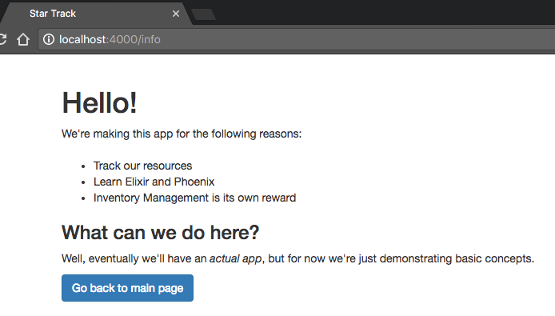
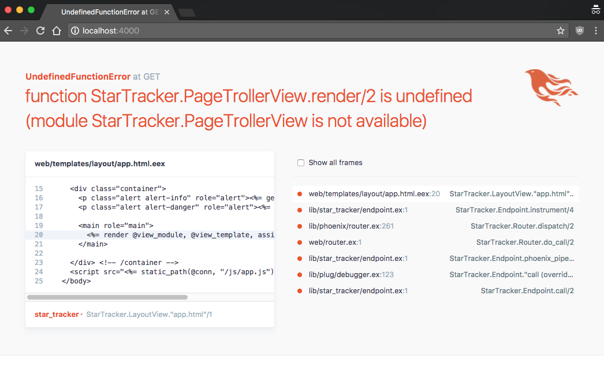
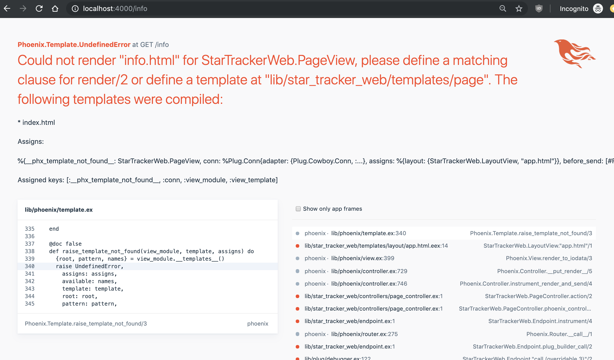

# Introduction

This book will focus on teaching you the fundamentals of web development.

Web development is a powerful tool that can help you in many endeavors--whether it's building a startup that can change the world, getting a job to provide for your family, making a web app as a creative expression, or using web development as a secret weapon to increase your effectiveness in your current career, I think that you'll be glad you invested the time into learning this valuable skill.

We’re going to learn web development using what I believe are some of the best tools available: Elixir (a blazing-fast programming language with friendly syntax), Phoenix (a modern web framework that combines functional programming with the best of Ruby on Rails), and Ecto (a maintainable system for interacting with the database).  (More on that later in this introduction)

## What are we building?

We'll be taking a **hands-on approach** to learning, which means you'll be practicing each concept quickly after you learn it, applying it in a real application when possible.  In addition to the code given in each chapter (which you should type into your computer and run), there will also be exercises, which I highly recommend you do--if you want to remember what you're learning.

Throughout this book we're going to be building the Star Tracker app, which boldly goes where no resource exchange app has gone before.

{ width=60% }

We'll be creating a way to buy and sell resources (mostly the elements that make up stars, hence the name) on a centralized market.  You click a button, you buy and sell a resource.  We'll use LiveView to automatically show the user when someone else makes a trade - without a page refresh, and without us writing a single line of Javascript.

It's not super fancy, but it gives us many opportunities to solidify the core concepts you'll need to start creating your own Phoenix apps (and understand the more advanced Elixir and Phoenix books, should you choose to read them).

## Why this book, and not Programming Phoenix or another book?

There are lots of great resources for intermediate and advanced developers to learn Elixir and Phoenix, but relatively little for beginners.  In addition, the resources that do exist tend to rush past the core web framework features in order to get to the cool advanced features that set the framework apart, like Channels and OTP.

This book aims to be your first Elixir and Phoenix book (and maybe even your first web development book), but not your last.  We'll go into the basics of the language and the framework, giving you a solid foundation so you can crank out simple web apps and be prepared to read and understand the books written on more advanced topics.

That said, this is not meant to be your first introduction to programming.

## Prerequisites

While I don't expect you to have familiarity with Elixir or web programming, I do expect you to know how to put together a simple program in *some* language.  If you don't meet that standard, here are some good (free) resources:

* [Intro to Computer Science](https://www.udacity.com/course/intro-to-computer-science--cs101) (A video course that teaches Python basics)
* [How to Design Programs](http://www.htdp.org/2003-09-26/) (this Lisp book is how I learned)
* [Invent With Python](http://inventwithpython.com/) (Book series that involves making lots of games)

## Why Phoenix and Elixir?

> This section uses advanced terminology in order to compare Phoenix and Elixir to other tools.  If you don't understand something here that's okay--just read to get the general gist of it.  There will be a summary at the end.

The current king of the backend Web Framework world is Ruby on Rails--it's what is taught at hundreds of Coder Bootcamps and used at thousands of startups (as well as some large companies).  However, many of the leading lights of the Ruby and Rails worlds have moved on, and a significant number of them have moved to Elixir and Phoenix.  Why is that?

{ width=60% }

The answer is that Elixir combines the power, speed, and reliability of the Erlang VM with the beauty and expressiveness of Ruby syntax.  In one stroke it fixes the biggest complaint about each language- speed for Ruby and syntax for Erlang.

The Elixir ecosystem has also learned a lot from both languages.  From Ruby it takes many of the most popular tools and combines them into one tool with a consistent interface: Mix.  From Erlang it takes... the entire Erlang ecosystem; you can use any Erlang package you want in Elixir (just be prepared to look at some not-as-beautiful code).

Phoenix itself has benefited greatly from seeing what Rails has done.  It's taken what worked well (convention over configuration, REST, the Rails MVC style, friendly build tooling, etc.) while doing some much-needed modernization.  Some of the modernizations are made available simply by escaping the inertia of the Rails codebase and creator DHH's opinions.  Others are unlocked due to the increased power and features of Elixir as compared to Ruby.

So here are the biggest advantages of Phoenix and Elixir, in fancy listicle form:

* SPEED

Elixir is an order of magnitude (~10X) faster than Ruby right out of the box.  This not only gets you faster response times and lets you handle more requests per box, but it eliminates a whole class of performance hacks and opens the door for doing things that would not be wise in Ruby.

* Reliability

Elixir is built on the Erlang VM, which has created systems with "nine nines" of reliability- that is, it was working 99.9999999% of the time.  This reliability isn't necessarily because individual parts crash less often, but because it can recover seamlessly from crashes- a "self healing" network of processes.  We won't get into this mechanism in detail in this book.

* Real-time features

Channels/Sockets that are just as easy as in Node (the current Sockets king), but in Elixir they're more performant.  This means that "real-time" communication between server and client is a breeze compared to other languages and frameworks.

* Functional Programming Style

This can occasionally cause frustration for those coming from an Object-Oriented language (such as Ruby), but once you become acclimated it means fewer bugs and more readable code.  You also get really cool features like Pattern Matching and piping that are not available in Object-Oriented languages.

* LiveView

Tired of sprinkling Javascript all over your app?  LiveView lets you do form validations, auto-completes, complex interactions, and [even real-time gaming](https://gist.github.com/chrismccord/60a5705482d26326675c7b752ed0dacd), all from the server.  But it doesn't just eliminate the burden of managing two separate frameworks... it's going to do for real-time apps what Rails did for request/response CRUD apps.

---

> **Technobabble: When to use Phoenix vs Other web frameworks?**

> Phoenix is still a newer technology, but it's well past 1.0 and stable enough to run production apps (and the underlying technologies--Elixir and Erlang--are rock solid).

> If you're starting a new project, choose Phoenix!  But if you have a legacy project then there are more tradeoffs to consider.

> I'd say that if you are having performance problems which can't be solved with basic solutions (such as fixing n+1 database queries) then it may be worth it to switch to Phoenix.  High availability requirements are another good reason.  It also may be worth it if your project involves lots of concurrency or sockets- stuff that most languages and frameworks do poorly, but Elixir and Phoenix do really really well.

> Another huge reason to switch to Phoenix is if you want real-time interactive apps.  Phoenix LiveView lets you have that without having to manage two frameworks + an API layer, like you would if you used, for example, Rails and React. It's also fantastic for dashboards and other apps that need up-to-date information from the server.

> If you're investigating Phoenix, then it's likely that you fall into one of those camps.  However, if you're happy with your current tech, or if you're unhappy for different reasons, consider whether the benefits of Phoenix will be worth the cost of a rewrite.

---

## Why Phoenix? (for beginners)

If you're a beginner that didn't quite understand all of the last section, here's the tl;dr on why Elixir/Phoenix/Ecto can be a better choice than Ruby/Ruby on Rails/ActiveRecord or other popular web programming tools:

* Phoenix is an order of magnitude faster (due to Elixir's use of the Erlang VM)
* Your Phoenix code is significantly less likely to descend into spaghetti code (due both to Elixir’s functional programming and Phoenix and Ecto’s learning many lessons from how web apps can go wrong)
* LiveView means you don't have to learn React
* You'll be prepared to take advantage of Elixir's advanced features *when their use becomes necessary*

## Conclusion

I hope you're as excited as I am to begin!  Turn the page and we'll start installing Elixir.


 \pagebreak 

# Changelog


* Fixed typos/grammar

### 0.1.4

* Updated Introduction to include LiveView
* Updated to Elixir 1.8.1
* Fixed typos/grammar
* A bit of time has passed since the last update, but things should be going super fast from here on out.

### 0.1.3

* **Website Created**

### 0.1.2

* Added a Captain's Log for snake_case vs PascalCase
* Added technobabble for assignment vs pattern matching
* Added a note on tab auto-complete in iex
* Renamed `recombinePhraseRequired` function to `recombine`
* Updated Arguments exercise to be easier to understand
* Updated Maps exercise to not accidentally resemble a Ruby on Rails convention
* Added paragraph on destructuring Maps
* Removed errant camelCases and incorrect references to hashes
* Updated String section for clarity
* Fixed some typos/grammar stuff

### 0.1.1

* Rewrote the introduction
* Rewrote immutability section, starting with simpler examples and showing an example of mutable data
* Rewrote the case statement section, starting with a simpler example
* Demarcated all code samples in exercises as code (so they are easier to copy/paste)
* Indent iex output lines so they're easier to read
* Fixed many typos
* Turned all usages of "method" to "function"
* Made pattern matching exercises a bit more clear
* Added a captain's log about the command line conventions
* Added a captain's log about the interpreter
* Added a captain's log about loading elixir files
* Added a captain's log about function ordering
* Added flavor bits to captain's logs, to hint at a story
* Added acknowledgements
* Added changelog
* Added copyright and license
* Pdf version: links in footnotes
* Pdf version: Give codeblocks a background color
* Pdf version: Decreased margins so codeblocks fit
* Many small improvements/rewordings

## 0.1

* **Introduction and first section created.**


 \pagebreak 

# Acknowledgements

A huge thanks to those who have offered feedback on the manuscript: Derek Wood, Franco Barbeite, Giuseppe Caruso, Richard Poole, Matthew Davis, Peter Karth, and Joep Stender.  This book would be much worse without them.


 \pagebreak 

# Copyright and License

*The Phoenix Tutorial*. Copyright 2017-2019 by Jeffrey Biles.

All source code in *The Phoenix Tutorial* is available under the MIT License.  The book itself and the non-code writing is, unless specifically stated otherwise, copyright Jeffrey Biles.

---

> The MIT License

> Copyright (c) 2017-2019 Jeffrey Biles

> Permission is hereby granted, free of charge, to any person obtaining a copy
of this software and associated documentation files (the "Software"), to deal
in the Software without restriction, including without limitation the rights
to use, copy, modify, merge, publish, distribute, sublicense, and/or sell
copies of the Software, and to permit persons to whom the Software is
furnished to do so, subject to the following conditions:

> The above copyright notice and this permission notice shall be included in
all copies or substantial portions of the Software.

> THE SOFTWARE IS PROVIDED "AS IS", WITHOUT WARRANTY OF ANY KIND, EXPRESS OR
IMPLIED, INCLUDING BUT NOT LIMITED TO THE WARRANTIES OF MERCHANTABILITY,
FITNESS FOR A PARTICULAR PURPOSE AND NONINFRINGEMENT.  IN NO EVENT SHALL THE
AUTHORS OR COPYRIGHT HOLDERS BE LIABLE FOR ANY CLAIM, DAMAGES OR OTHER
LIABILITY, WHETHER IN AN ACTION OF CONTRACT, TORT OR OTHERWISE, ARISING FROM,
OUT OF OR IN CONNECTION WITH THE SOFTWARE OR THE USE OR OTHER DEALINGS IN
THE SOFTWARE.

---


 \pagebreak 

# Installing Elixir

## Hello World

Welcome to The Phoenix Tutorial.  I'm so glad you decided to join us!

---

> **Captain's Log: The Introduction**

> Stardate: far future.

> I have just discovered the first fragments of this fascinating manuscript detailing the Phoenix technology that underlies our fleet.

> At first I wasn't sure what I was reading, since it seemed to jump straight into technical instructions, but then I went back and read the Introduction and it all made sense.

> I'll be recording my observations, both for myself, and so that others may continue my research should anything... happen.

---

As we said in the intro, we'll be taking a **hands-on approach** to learning.  And that means that before we can do anything, you're going to have to get Elixir installed on your computer.

## Installation

Installing Elixir is the most system-dependent installation step of this entire book.  Each function shared will install both Elixir and Erlang, the language which Elixir builds on top of.

Check which operating system you are using and follow the associated instructions.

---

> **Captain's Log: Command Line Notation**

> When we find a dollar sign at the beginning of a line of code, it appears to signify that everything following should be typed out on the reader's "command line".

> The command line was the 21st-century equivalent of our ship computer; you tell it a command (by typing with your fingers--such barbarians!) and it does exactly what you ask.  The most common name for this command line was "bash" (as I said--violent barbarians!), but there were several other variants in use.

> I will continue reporting my findings as I uncover more of this fascinating 21st-century document.

---


### Mac

1. Install or update homebrew

```bash
$ /usr/bin/ruby -e "$(curl -fsSL
https://raw.githubusercontent.com/Homebrew/install/master/install)"
```

or

```bash
$ brew update
```

2. Install Elixir

```bash
$ brew install elixir
```

### Windows

Download the Installer and run it: [https://repo.hex.pm/elixir-websetup.exe](https://repo.hex.pm/elixir-websetup.exe)

If you're using Windows, make sure you have the Bash shell installed (https://msdn.microsoft.com/en-us/commandline/wsl/about).  This new feature, available on Windows 10 and above, will allow you to use the same shell commands as Linux and Mac users.

### Other

You can find instructions for other platforms (mostly Linux flavors) at [http://elixir-lang.org/install.html](http://elixir-lang.org/install.html).

If your Linux is Debian-based, be sure to explicitly install Erlang so you can get all the necessary packages (instructions here:
[http://www.phoenixframework.org/docs/installation#section-erlang](http://www.phoenixframework.org/docs/installation#section-erlang))

## Installing Hex

From here on out things get (generally) platform-agnostic.  There are a couple of extra commands for those on Debian-based systems, which can be found on the Phoenix Installation Guide: [http://www.phoenixframework.org/docs/installation](http://www.phoenixframework.org/docs/installation)

Hex is the Erlang package manager, which lets us specify and download our dependencies.  Mix is our Elixir task runner.  We'll use Mix (which came with Elixir) to install Hex.

```bash
$ mix local.hex
```

We'll talk more about both of these later.

## Conclusion

We've got Elixir installed now and we're ready to start learning!  In the next couple chapters we'll go over the basics of the language, with a preference towards what is most commonly used in Phoenix.


 \pagebreak 

# Getting Started with Elixir

Elixir is an awesome language that is filled to the brim with exciting features.  In part 1 we're only going to cover the basics--enough to get started with Phoenix.  Then in subsequent parts of this book we'll add on more language constructs as needed.

## The Elixir Interpreter

In order to show off the language features, we'll want to jump down to something simpler than a full Phoenix app.  To do that, we're going to use the Elixir Interpreter from the command line.

Open it up by typing `iex` in your command line.

```bash
$ iex
```

Now you should see something like the following:

```zsh
$ iex
  Erlang/OTP 21 [erts-10.3.4] [source] [64-bit] [smp:8:8] [ds:8:8:10] [async-threads:1] [hipe] [dtrace]

  Interactive Elixir (1.8.1) - press Ctrl+C to exit (type h() ENTER for help)
iex(1)>
```

This is good!  That means it's working.

> This guide uses Elixir 1.8.1, but it should work as long as the first number (major version) is '1' and the second number (minor version) is 8 or greater.  The third number is called the patch version, if you're curious.

Now you can type Elixir code in and it'll run right there (after you hit the Enter key).

```bash
iex(1)> 2 + 3
        5
```

Boom.  Type in `2 + 3`, hit enter, and it shows the result `5` in the line below.

> Your interpreter will show the results all the way to the left, but I've indented the results in this book so input/output lines are easier to differentiate and so output is easier to match up with the input that produced it.

When we build our Phoenix app we'll spend the majority of our time interacting with it in other ways, but we'll always have the option to drop back to the interpreter and play around.

```bash
iex(1)> 2 + 3
        5
iex(2)> (2 + 3) * 3
        15
iex(3)> 2 + (3 * 3)
        11
iex(3)> num_tacos = 3
        3
iex(4)> num_burritos = 3 * 5
        15
iex(5)> num_tacos + num_burritos
        18
```

The above demonstrate numbers, basic math, order of operations with parentheses (this will apply to more than just math), and the assignment and use of variables.

---

> **Captain's Log: Command Line Interpreter**

> Our scientists have discovered how to access the Command Line Interpreter (iex) that this manuscript speaks of.  

> At first we thought that we had forever trapped our computers in the interpreter, but we eventually discovered that we could exit by hitting Ctrl + C twice in a row.  This is good for when you're done, or if you get the interpreter into a weird state you don't understand.

> Exiting and re-entering also solved another mystery- the numbers in the interpreter prompt.  A few more superstitious in our crew thought them at first some sort of sinister countdown, but they are simply the number of lines since the interpreter started.

---

## Interpreter Exercises

What is displayed when you type each of these into the command line interpreter?  After thinking about it, test your answer.

1. `2 * 10`
2. `(2 * 10) + 3`
3. `2 * (10 + 3)`
4. `num_tacos = 2 + 3; pepper_per_taco = 3; num_tacos * pepper_per_taco`

(If you can't guess what `;` does, just go ahead and play around with it. Playing and testing your hypotheses is cheap in the command line!)

## Strings

There are two types of Strings in Elixir.

```elixir
iex(1)> "hello universe"
        "hello universe"
iex(2)> 'hello universe'
        'hello universe'
```

For the purposes of this book we'll be using double-quoted strings (sometimes called Binaries).  Single-quoted strings (sometimes called Char Lists) are mostly used when interfacing with old Erlang libraries.

---

> **Technobabble: Binaries vs Char Lists**

> Single-quoted strings are Lists of Characters and double-quoted strings are UTF-8 encoded binaries represented by a series of graphemes.  Even though we think of both of them as "Strings", we use different sets of functions on each.

> For a fun demonstration of a quirk of Char Lists, try putting `[111, 111, 112, 115]` in the command line.

---

Here's some basic inline usages of strings

```bash
iex(1)> "hello" <> "universe"
        "hellouniverse"
iex(2)> "hello" <> " universe"
        "hello universe"
iex(3)> place = "universe"
        "universe"
iex(4)> "hello #{place}"
        "hello universe"
```

Aside from these inline usages, most action on strings happens via functions being applied to them.  Here's an example:

```bash
iex(5)> phrase = "hello vast universe"
        "hello vast universe"
iex(6)> String.split(phrase, " ")
        ["hello", "vast", "universe"]
iex(7)> upcase_phrase = String.upcase(phrase)
        "HELLO VAST UNIVERSE"
iex(8)> phrase <> " -> " <> upcase_phrase
        "hello vast universe -> HELLO VAST UNIVERSE"
```

The string usage above is simple but allows us to demonstrate two important facets of how Elixir works.

First, when we call `split` and `upcase`, we're not changing the original phrase.  Instead, we're creating a new copy of the phrase, which can be assigned to a variable (such as `upcase_phrase`).  The original string is "immutable"--that is, it cannot be changed (although a new immutable value could be assigned to the variable `phrase`).  We'll go over immutability in more detail in chapter 5 of this section.

Second, instead of calling a function which is stored on the string itself (`phrase.split(" ")`) we take our function and apply it to the string (`String.split(phrase, " ")`).  This may seem like a trivial difference, but in fact it is vital to understanding the functional nature of Elixir.

## Functional vs. Object-Oriented

In an object-oriented language the phrase would be an instance of the class String, and would therefore have available to it all the String functions.  Hence you could call `phrase.split(" ")`.

In a functional language, the phrase is the data, which can be acted upon by functions.  These functions are organized, so the most common functions which can act upon strings are stored in the `String` module, but what's important is we're separating out the data from the function instead of throwing them all in one "object".

If this doesn't make sense to you, that's okay--just move on.  We'll cover modules in the next chapter (and make our own), and the functional style of coding will become clearer to you as you write more Elixir.

## String exercises

What is displayed when you type each of these into the command line?  After thinking about it, test your answer.

1. `String.split("hello amazing universe", " ")`
2. `String.split("hello amazing universe", "i")`
3. `setting = "stun"; "set phasers to #{setting}"`

## Enum

The `Enum` module is meant for working with Enumerables.  Although there are others, the most common type of Enumerable is a list, so that's what we'll be working with today.

```bash
iex(1)> split_phrase = ["hello", "vast", "universe"]
        ["hello", "vast", "universe"]
iex(2)> Enum.count split_phrase
        3
iex(3)> Enum.join split_phrase, "-"
        "hello-vast-universe"
iex(4)> Enum.member? split_phrase, "universe"
        true
iex(4)> Enum.member? split_phrase, "univers"
        false
```

Once again we have our functions which are organized by module (`Enum`), which are then applied to the data (`split_phrase`).

We're also demonstrating a parentheses-free function syntax.  It's equivalent to having parentheses, except it's a bit cleaner (but, in some cases, more ambiguous.  In those cases parentheses should be added back for clarity).

## Char Lists vs Binaries

As an aside, remember how we have single-quoted strings (arrays of Chars) and double-quoted strings (binaries)?  Those types end up being important.  We use `Enum` functions on single-quoted Strings, and `String` functions on double-quoted Strings.

```bash
iex(1)> Enum.count 'hello'
        5
iex(2)> Enum.count "hello"
        ** (Protocol.UndefinedError) protocol Enumerable not implemented for "hello"
            (elixir) lib/enum.ex:1: Enumerable.impl_for!/1
            (elixir) lib/enum.ex:146: Enumerable.count/1
            (elixir) lib/enum.ex:467: Enum.count/1
iex(3)> String.split 'hello universe'
        ** (ArgumentError) argument error
            (stdlib) :binary.split('hello universe',
            ["　", " ", "
", "
", " ", " ", " ", " ", " ", " ", " ", " ", " ", " ", " ",
            <<194, 133>>, " ", "\t", "\n", "\v", "\f", "\r"], [:global, :trim_all])
            (elixir) lib/elixir/unicode/properties.ex:344: String.Break.split/1
iex(4)> String.split "hello universe"
        ["hello", "universe"]
```

> Want to see something cool?  Press 'tab' in iex to trigger an autocomplete.  So you type in "Stri", hit 'tab', and it'll complete it to "String".

> Even better, if there are multiple options, it will show you all of them that match your search.  Try hitting tab after typing in "String." (make sure to include the dot)- it'll show you all of the functions available on that module.

## Enum Exercises

What is displayed when you type each of these into the command line?  After thinking about it, test your answer.

1. `Enum.member?(["hello", "vast", "universe"], "hello")`
2. `Enum.member?(["hello", "vast", "universe"], "hello vast universe")`
3. `Enum.join(["hello", "vast", "universe"], "! ")`
4. `Enum.join(["hello", "vast", "universe"], "joining with this string is a very bad idea")`


## Chaining functions together

Let's say we wanted to count how many words are in a certain phrase.  We don't have a "word count" function, but we can get there by applying multiple functions in a row.  

There are several ways we could do this.  Here's the first.

```bash
iex(1)> phrase = "boldly going where no man has gone before"
        "boldly going where no man has gone before"
iex(2)> split_phrase = String.split(phrase)
        ["boldly", "going", "where", "no", "man", "has", "gone", "before"]
iex(3)> count = Enum.count split_phrase
        8
```

If you're unsure of where you're going and what to check at every step, that's probably the best way to go.  However, for production code it can look a bit messy.  Here's another way that's a bit more compact:

```bash
iex(1)> Enum.count(String.split("boldly going where no man has gone before"))
        8
```

Here we're nesting the function calls so the result of one gets fed into the other.  This is more compact, but it can still look messy.

A great solution to this is the pipe syntax.

## The Pipe Syntax

In the pipe syntax, we can take the results of one function and "pipe" it as the first argument of the next function.

```bash
iex(1)> "boldly going where no man has gone before" |> String.split |> Enum.count
        8
```

It's a couple more characters than the previous one, but it's far more readable.  You have the subject first (the phrase), and then you pass that phrase to `String.split`, then pass the results of that to `Enum.count`.

If you have multiple arguments, you just pass the second (and third and fourth, etc.) arguments with the function.

```bash
iex(1)> "boldly going where no man has gone before" |> String.split() |> Enum.join("-")
        "boldly-going-where-no-man-has-gone-before"
```

When you're piping functions, be sure to use parentheses for your arguments--the compiler can usually infer them, but the pipe syntax makes that more difficult and so it's best to be explicit.

Working with pipes is a core part of the Elixir experience, and so most functions you encounter will be designed with piping in mind--they'll take *data* as their first argument, and then configuration for their other arguments.  You can see this with `Enum.join`, which takes in the list as the first argument and then `"-"` as the second argument.

## Pipe Exercises

What is displayed when you type each of these into the command line?  After thinking about it, test your answer.

1. `"boldly going where no man has gone before" |> String.length`
2. `"boldly going where no man has gone before" |> String.split(" ") |> Enum.member?("boldly")`
3. `"boldly going where no man has gone before" |> String.upcase |> String.split(" ") |> Enum.join("... ")`

## Conclusion

Already each individual line of Elixir should be looking less mysterious than before, but there's still plenty to learn.  In the next chapter we'll go over how to create and use custom functions.


 \pagebreak 

# Functions

So far in our exploration of Elixir we've typed our code directly into the Elixir interpreter, but for complex functions -- not to mention building an entire program -- we'll want a place to store our functions.

In this chapter we'll learn how to store our code by defining modules and functions.

## Storing Code: defmodule and def

Start by creating a file.  I'm going to call mine `basic_elixir.ex`, but the only part of this name that you are required to copy is the `.ex` file extension, which signals that this is an Elixir file.

Then we'll create the minimum viable module in this file:

```elixir
defmodule LearningElixir do
  def hello do
    "boldly going where no man has gone before"
  end
end
```

Our module, defined by `defmodule` (DEFine MODULE), is `LearningElixir`.  Attached to that we have a `do` and its closing `end`.  This pair of "delimiters" indicates that anything in between them is part of the `LearningElixir` module.  Some languages use whitespace or curly braces as their delimiters, but Elixir has copied Ruby and uses the more descriptive `do` and `end` keywords.

Our function `hello` is defined by `def`.  It also has a do/end delimiting block.  Inside that block is the string "boldly going where no man has gone before", which is what is returned when we call that function.

Let's go ahead and load that file in the Interpreter.

```zsh
iex(1)> import_file "basic_elixir.ex"
        {:module, LearningElixir,
         <<70, 79, 82, 49, 0, 0, 4, 52, 66, 69, 65, 77, 65, 116, 85, 56, 0, 0, 0, 134,
           0, 0, 0, 13, 21, 69, 108, 105, 120, 105, 114, 46, 76, 101, 97, 114, 110, 105,
           110, 103, 69, 108, 105, 120, 105, 114, 8, ...>>, {:hello, 0}}
iex(2)> LearningElixir.hello
        "boldly going where no man has gone before"
```

---

> **Captain's Log: Loading Elixir Files**

> It took much experimentation, but we have finally discovered how to load code into the ship's interpreter.

> Our error was that we were in the wrong folder- the computer didn't know how to find `basic_elixir.ex`.  Our solution: be in the same folder as the file when we start the Elixir interpreter.

> Our scientists have reported that we may be able to access the file from a different folder by specifying the path but, truth be told, I prefer the simple way.

---

We load the file into the Interpreter with the command `import_file`.  We can ignore the output for now; only notice that we see both `LearningElixir` and `hello` in various forms.

Then we call our function with `LearningElixir.hello` and get back the expected string.

> Note that we precede the function name with the name of the module within which it resides.  Apply the logic to our commands from the previous chapter and we can see that `String.split` was calling the `split` function on the `String` module.

Next let's define a new function, which has the code that we had previously inputted directly into the command line:

```elixir
defmodule LearningElixir do
  def phrase do
    "boldly going where no man has gone before"
  end

  def recombine do
    phrase |> String.split |> Enum.join("-")
  end
end
```

We've renamed `hello` to `phrase`, then used it in our `recombine` function.  Note that since we're within the `LearningElixir` module we don't need to precede `phrase` with `LearningElixir`- `phrase` is currently directly available because it's "within scope".

---

> **Captain's Log: Scope**

> Scope can be a scary word, but here's a basic way to think about it.  If you're in your ship's common room, and you say "I would like to sit on the couch", you don't have to specify which of the millions of couches you're sitting on.  You're in the common room scope, so when you're trying to think of couches, the one in the ship's common room comes to mind first.

> It's the same reason that if you talked to someone in the old United States about "the civil war", they'll immediately think of the American Civil War, not the Spanish Civil War, the American Revolution, or the Klingon Civil War.  That's because they're scoped to the United States.

> Scope isn't as big a deal in Elixir as it is in Object-Oriented languages, but it's still important to understand.

---

The rest of our `recombine` function is just like what we previously did directly in the interpreter.

Let's load and call this in the interpreter.

```zsh
iex(3)> import_file "basic_elixir.ex"
        warning: redefining module LearningElixir (current version defined in memory)
          iex:1

        warning: variable "phrase" does not exist and is being expanded to "phrase()",
        please use parentheses to remove the ambiguity or change the variable name
          iex:7

        {:module, LearningElixir,
         <<70, 79, 82, 49, 0, 0, 5, 40, 66, 69, 65, 77, 65, 116, 85, 56, 0, 0, 0, 182,
           0, 0, 0, 18, 21, 69, 108, 105, 120, 105, 114, 46, 76, 101, 97, 114, 110, 105,
           110, 103, 69, 108, 105, 120, 105, 114, 8, ...>>, {:recombine, 0}}
iex(4)> LearningElixir.recombine
        "boldly-going-where-no-man-has-gone-before"
```

The result of `LearningElixir.recombine` is what we would expect if we straightforwardly combined what we previously knew.

Less expected are the two warnings.  

The first warning is the result of importing the same file (and thus defining the same module) twice in one interpreter session.  If we had restarted the interpreter in between loading the file then this warning would not show up.  

The second warning is because `phrase` is somewhat ambiguous- it could be either a variable or a function.  The interpreter automatically (and correctly) expands it to `phrase()`, which is the less ambiguous way to call a function.

There are two ways to solve the ambiguity:

```elixir
defmodule LearningElixir do
  def phrase do
    "boldly going where no man has gone before"
  end

  def recombine1 do
    phrase() |> String.split |> Enum.join("-")
  end

  def recombine2 do
    LearningElixir.phrase |> String.split |> Enum.join("-")
  end
end
```

The first is exactly what's suggested by the warning: add in the parentheses.  The second makes explicit the fact that `phrase` is defined on the `LearningElixir` module, thus removing the ambiguity.  I personally prefer the second solution (it makes the function more portable because you don't have to worry about scope), but either works.

Finally, now that we're in a proper file we don't have to define everything on one line.

```elixir
defmodule LearningElixir do
  def phrase do
    "boldly going where no man has gone before"
  end

  def recombine do
    LearningElixir.phrase
    |> String.split
    |> Enum.join("-")
  end
end
```

This version of `recombine` does exactly the same as our last version, but now instead of having everything in one line we have the pipes lined up vertically.  This can be very convenient for seeing at a glance how a function is composed.

## Exercises

1. Create the `LearningElixir` module, with the `phrase` and `recombine` functions in it.  Import it on the command line, then run `LearningElixir.recombine`.
2. Within that module, create the `upcase_phrase` function, which returns the phrase, but all in upper case letters.  Use the `phrase` function in your solution- you're cheating if you just type out the phrase manually in upper case.

```bash
> iex(1)> LearningElixir.upcase_phrase
          "BOLDLY GOING WHERE NO MAN HAS GONE BEFORE"
```

We introduced the relevant `String` function in the last chapter.

3. Within the same module, create the "upcase_dasherized_phrase" function, which returns the phrase, dasherized AND in all upper case.

## Conclusion

Now you know how to create a module that organizes your functions.  This increases your ability to organize your code aesthetically (lining up pipe operators) and opens up many new possibilities.  However, our current understanding is still very limited.

In the next chapter, we'll show how to create more flexible functions by giving them arguments- and by introducing our first instance of Pattern Matching, the functional programming design pattern that you'll soon grow to love.


 \pagebreak 

# Arguments and Pattern Matching

## Using Arguments

The `recombine` function is pretty cool, but it always uses the default phrase defined elsewhere in the module.  What if we wanted to allow the user the option of putting in their own phrase?

First we'll see how to *make* them input their own phrase:

```elixir
def recombine(phrase) do
  phrase
  |> String.split
  |> Enum.join("-")
end
```

This is the first function we've created that requires an argument, but we've used functions with arguments before.  When we call it we must feed it a phrase as input (with or without parentheses)

```bash
iex(1)> LearningElixir.recombine("hello world")
        "hello-world"
iex(2)> LearningElixir.recombine "hello world"
        "hello-world"
```

Next we'll figure out how to make the phrase argument *optional*.

There are several ways to do that.  The first solution we show, having a default value, will be typical of non-functional languages.  The second solution, which is modeled after a common Javascript pattern, will show us how different the two language's capabilities are and introduce us to the concept of Arity.  Finally, the third solution will take advantage of Elixir's functional abilities and give us our first taste of Pattern Matching.

## Default Value

```elixir
def recombine(phrase \\ LearningElixir.phrase) do
  phrase
  |> String.split
  |> Enum.join("-")
end
```

Here the argument has a *default value* of `LearningElixir.phrase`.  When defining an argument, you can put `\\` after an argument name and then give a default value- in this case, `LearningElixir.phrase`

```bash
iex(1)> LearningElixir.recombine
        "boldly-going-where-no-man-has-gone-before"
iex(2)> LearningElixir.recombine "hello universe"
        "hello-universe"
```

> Note: We skipped the `import_file "basic_elixir.ex"` line this time for brevity's sake, and we will continue to skip it, but you should keep calling `import_file` when you make changes.

This is a decent pattern for simple situations like what we have here, but is suboptimal once the complexity of your function starts to grow (specifically, the number and complexity of arguments passed to the function).

## Second Solution: Arity

Another way you could attempt to do this is to use the or (`||`) functionality.

```elixir
def recombine(phrase) do
  phrase = phrase || LearningElixir.phrase

  phrase
  |> String.split
  |> Enum.join("-")
end
```

In many languages, if you don't give a default value for an argument the default will automatically be `nil`.  However, this is not the case in Elixir.  Here's what happens if you try that:

```bash
iex(1)> LearningElixir.recombine()
        ** (UndefinedFunctionError) function LearningElixir.recombine/0
        is undefined or private.
        Did you mean one of:

              * recombine/1

            LearningElixir.recombine()
```

It's saying that `LearningElixir.recombine/0` is undefined or private... what does that mean?  Didn't we define `recombine`?  And what's that `0` afterwards?  The answer, as you may have guessed from this section header, is "arity".

"Arity" is a fancy word for the number of arguments a given function requires.  So we've defined LearningElixir.recombine/1 (a version of `recombine` with 1 argument), but not LearningElixir.recombine/0 (a version of `recombine` with 0 arguments).  This can be annoying when we're used to looser languages that default to `nil` automatically, but it's really helpful for when we accidentally forget an argument- Elixir will help us catch that bug right at the start.

We can, of course, "cheat" the arity system by providing default values:

```elixir
def recombine(phrase \\ nil) do
  phrase = phrase || LearningElixir.phrase

  phrase
  |> String.split
  |> Enum.join("-")
end
```

But the existence of the concept of arity, combined with Pattern Matching, opens up a better possibility.

## Pattern Matching

Pattern Matching is a way to define a function multiple times and then run a specific definition based on the arguments given.  One way to pattern match is by arity.

```elixir
def recombine(phrase) do
  phrase
  |> String.split
  |> Enum.join("-")
end

def recombine do
  LearningElixir.phrase |> LearningElixir.recombine
end
```

Here we're defining two versions of recombine- the first with an arity of 1 and the second with an arity of 0.  When we call it with an argument, we get the first version of `recombine`.  When we call it without an argument, we get the second version- which then calls the first version and feeds it the phrase we defined earlier.

```bash
iex(1)> LearningElixir.recombine "hello world, universe"
        "hello-world,-universe"
iex(2)> LearningElixir.recombine
        "boldly-going-where-no-man-has-gone-before"
```

Pretty cool, right?  There are lots of other ways you can employ pattern matching beyond simple number of arguments, and we'll go over those as they come up.

## Exercises

1.  Use pattern matching to add a 2-arity version of `recombine` which lets you input the join string.

```bash
iex(1)> LearningElixir.recombine("hello world, universe", " vast ")
        "hello vast world, vast universe"
iex(2)> LearningElixir.recombine("hello universe")
        "hello-universe"
```

2. Redefine the 1-arity version of `recombine` in terms of the 2-arity version.

That is, make it so that the 1-arity version calls the 2-arity version instead of repeating code.  You'll note that we already defined the 0-arity version to call the 1-arity version.

---

> **Captain's Log: Function Ordering**

> Our scientists have arranged the above functions of different arities in many orders, and have found no difference in how the program runs.

> However, in other situations the order does matter- Elixir will check the functions in order and use the first one that matches.  So we have made it a habit to put the more specific cases earlier in the file and the more general cases later in the file.

---

## Conclusion

Learning how to define functions with arguments (and using pattern matching to define multiple versions of a function) make our functions much more flexible and useful.

In the next chapter we'll introduce our first complex data type- Maps. Playing around with them will also lead us to the concept of Immutability- something very important in the functional programming world.


 \pagebreak 

# Maps and Immutability

## Maps

Maps (not to be confused with the `Enum.map` function) are a very common programming construct, although they might be called "hashes" or "dictionaries" in other languages (or even, confusingly, "objects" in Javascript).

Here's a basic map:

```elixir
defmodule LearningElixir do
  def my_map do
    %{
      "name" => "Enterprise",
      "type" => "CodeShip",
      "mission" => "Code Boldly"
    }
  end
end
```

---

> **Captain's Log: PascalCase vs snake_case**

> At first we thought the way the names were constructed was mere happenstance, a whim of the creators, but we have since determined a consistent pattern.

> Modules, such as LearningElixir, are PascalCase.  That means that each word that makes up the name is capitalized, and runs together with the other words with no separation.

> Functions and variable names, such as my_map, are snake_case.  That means that the words are entirely lower-case, and are separated by underscores.

---

It's started with a `%{`, ended with a `}`, and in between consists of key-value pairs separated by commas.  Each key-value pair has a key (such as "name") before the `=>` symbol (sometimes called the "rocket") and a value (such as "Enterprise") after the `=>` symbol.

We can interact with this map using the functions in the `Map` module.

```bash
iex(1)> Map.get(LearningElixir.my_map, "mission")
        "Code Boldly"
iex(2)> Map.get(LearningElixir.my_map, "bad_key")
        nil
```

Our first (and most common) Map function, `Map.get`, takes two arguments: the map (`LearningElixir.my_map`) and a key ("mission").  It will then grab the value attached to that key in the map.  If the key given doesn't exist in the map, it will return `nil`.

You can use brackets as shorthand for `Map.get`.

```elixir
iex(1)> LearningElixir.my_map["mission"]
"Code Boldly"
```

Another way to get an item from a map is to destructure it:

```elixir
iex(1)> %{"mission" => mission} = LearningElixir.my_map
        %{mission: "Code Boldly", name: "Enterprise", type: "CodeShip"}
iex(2)> mission
        "Code Boldly"
```

More on destructuring in the next chapter.

The next most common Map function is to add new values to the map with `put`.

```bash
iex(1)> Map.put(LearningElixir.my_map, "captain", "Picard")
        %{"captain" => "Picard", "mission" => "Code Boldly",
          "name" => "Enterprise", "type" => "CodeShip"}
iex(2)> LearningElixir.my_map
        %{"mission" => "Code Boldly", "name" => "Enterprise",
        "type" => "CodeShip"}
```

When we use `put`, it uses the second and third arguments as the key and value respectively, and adds them to the map.  The result is seen after the first line.  However, you'll notice that when we call `LearningElixir.my_map` again, the new key-value isn't there.

## Immutability

That's because data in Elixir is "immutable".  That means that each piece of data will never change.  What `put` does is create a *new* piece of data and then assigns it to a variable.

To understand what "immutable" means, we'll have to contrast it with data in a mutable language.  Here's some Javascript:

```javascript
> var mutableArray = ["Don't", "try", "this", "at", "home"];
  undefined
> mutableArray.shift()
  "Don't"
> mutableArray
  ["try", "this", "at", "home"]
```

> Don't worry if you don't understand the syntax of Javascript.  The important thing is that you understand the differences between mutable and immutable languages, not the specifics of this example.

Above, we're assigning 5 strings to the variable `mutableArray`.  Then we call the `shift` method on the `mutableArray`, which returns the first value in the array and has the *side effect* of removing that string from the array.  The array now only has 4 elements.

Contrast that with immutable data, where there will never be side effects- no matter what you call on an array with 5 items, it will always be an array with 5 items.

Of course, the return value of the function can be something other than 5 items.

```bash
iex(1)> immutable_array = ["Immutability", "is", "great", "don't", "you", "agree"]
        ["Immutability", "is", "great", "don't", "you", "agree"]
iex(2)> Enum.slice(immutable_array, 4, 2)
        ["you", "agree"]
iex(3)> immutable_array
        ["Immutability", "is", "great", "don't", "you", "agree"]
```

So even though you call `Enum.slice` with `immutable_array` and get back an array with 2 items, `immutable_array` is still what it started as.  There are no side effects.

Of course, there's a trick you can play with the data- take the result of the calculation and *immediately reassign it* to the variable you used.

```bash
iex(1)> immutable_array = ["Immutability", "is", "great", "don't", "you", "agree"]
        ["Immutability", "is", "great", "don't", "you", "agree"]
iex(2)> immutable_array = Enum.slice(immutable_array, 4, 2)
        ["you", "agree"]
iex(3)> immutable_array
        ["you", "agree"]
```

Oh no!  Even naming it `immutable_array` didn't stop that disaster!  How is this immutable data?

The array that `immutable_array` originally pointed to is still 5 items long.  It's just that we told `immutable_array` to point to a new, different array- one that was the result of calling `Enum.slice` on the original `immutable_array`.

Imagine if you could start calling yourself Germany and then the entire country of Germany could no longer be found.  Germany would still exist -- you didn't mutate it -- but everyone that was looking for Germany found you instead.  All planes flying to Germany would go straight to your house.  A disaster.

That's what it's like reassigning a variable.

One way around this is to keep on assigning stuff to new variables:

```bash
iex(1)> phrase = "boldly going where no man has gone before"
        "boldly going where no man has gone before"
iex(2)> phrase2 = String.split(phrase, " ")
        ["boldly", "going", "where", "no", "man", "has", "gone", "before"]
iex(3)> phrase3 = Enum.join(phrase2, "... ")
        "boldly... going... where... no... man... has... gone... before"
iex(4)> phrase
        "boldly going where no man has gone before"
iex(5)> phrase3
        "boldly... going... where... no... man... has... gone... before"
```

That method, however, can get tedious.  That's one reason why the pipe (`|>`) construct is so popular in Elixir- it allows you to pass on the output of a function and use it as the first argument in the next function call, without the bother of naming it

```bash
iex(1)> phrase =
...(1)> "boldly going where no man has gone before" |>
...(1)> String.split(" ") |>
...(1)> Enum.join("... ")
        "boldly... going... where... no... man... has... gone... before"
iex(2)> phrase
        "boldly... going... where... no... man... has... gone... before"
```

Remember: in the command line we put the pipe at the end of the line, to let the Elixir interpreter know that we have more coming on the next line.

Now let's apply this to `Map.put`:

```bash
iex(1)> my_map = LearningElixir.my_map |>
...(1)> Map.put("captain", "Picard") |>
...(1)> Map.put("spock replacement", "Data")
        %{"captain" => "Picard", "mission" => "Code Boldly", "name" => "Enterprise",
          "spock replacement" => "Data", "type" => "CodeShip"}
iex(2)> my_map
        %{"captain" => "Picard", "mission" => "Code Boldly", "name" => "Enterprise",
          "spock replacement" => "Data", "type" => "CodeShip"}
```

We were able to feed the results of each line into the first argument of `Map.put`, then assign the whole thing to `my_map` without intermediate steps or explicit reassigns.  This approach gives us a syntax as convenient as mutability, but with the stability and long-term simplicity of immutability.

## Exercises

What will be the results from running each of the following functions?

```elixir
def one do
  map = %{"hello" => "universe"}
  Map.put(map, "discarded", "data")
  map
end

def two do
  map = %{"hello" => "universe"}
  Map.put(map, "information", "data")
end

def three do
  %{"hello" => "universe"}
  |> Map.put("exploration_style", "bold")
  |> Map.put("starship", "Enterprise")
end

def four do
  %{"hello" => "universe"}
  |> Map.put("exploration_style", "bold")
  |> Map.put("starship", "Enterprise")
  |> Map.get("hello")
end
```

Be sure to check your work by copying the functions into a file and then running them.

## Conclusion

In this chapter we introduced our most complex data-type to date: Maps.  We learned how to get data from a map, and then how to update the data on a map- through creating a new copy of the map with updated data, because data in Elixir is immutable.

In the next chapter we'll introduce two more data types- Atoms and Tuples.  They'll let us expand our range with pattern matching capabilities significantly, especially when combined with the `case` statement.


 \pagebreak 

# Atoms, Tuples, and Case Statements

In this chapter we'll cover three more basic Elixir concepts that are used often in Phoenix apps.  We'll also combine them (and build on the concepts we've previously learned) in order to discover even more ways of pattern matching.

## Atoms

Here's an example of an atom: `:name`.

Atoms are kind of like Strings, except that they can't be manipulated.  `"Name"` could be fed into `String.upcase |> String.slice(1, 3)`, which would output `"AME"`.  `:name` will always and forever be `:name`, unless it is first explicitly turned into a String. Hence the name: an atom is irreducible.

At first glance, Atoms could be dismissed as a less-capable replacement for Strings... but their power is in their limitations, both in the signaling value to humans (it will not be manipulated) and in the conveniences that it allows.

One popular use of atoms is as the key in a Map.  Here's what `my_map` from the last section would look like with a simple replacement:

```elixir
defmodule LearningElixir do
  def my_map do
    %{
      :name => "Enterprise",
      :type => "CodeShip",
      :mission => "Code Boldly"
    }
  end
end
```

Now when we want to access the code, we use an atom instead of a String:

```bash
iex(1)> LearningElixir.my_map[:name]
        "Enterprise"
iex(2)> LearningElixir.my_map["name"]
        nil
```

But here's the first convenience that atoms unlock:

```bash
iex(3)> LearningElixir.my_map.name
        "Enterprise"
```

This is much nicer than the clunky `["string"]` and `[:atom]` syntax.

You can also make your Map syntax nicer with atoms:

```elixir
defmodule LearningElixir do
  def my_map do
    %{
      name: "Enterprise",
      type: "CodeShip",
      mission: "Code Boldly"
    }
  end
end
```

That looks much cleaner than what we had before, and works the exact same way when being called as the `:name => "Enterprise"` syntax.

So we've got a bit of convenience and syntax nicety- why else would we use atoms?

The primary benefit of atoms comes in their signaling value.  A String can be manipulated- capitalized, split, reversed, etc. Elixir Strings are technically immutable (unchanging), but reassignment and piping make it easy for them to be manipulated without technically being mutated.  On the other hand, if an atom starts as `:name`, it will go through the entire system as `:name` (unless explicitly turned into a String and then turned back into an atom).

---

> **Captain's log: changing an Atom**

> I have noticed that these Atoms, though supposedly indivisible, can be turned into a String or a Char List.  This is, of course, a terrible idea, and should never be attempted.  Not even for a handy plot point!  Like the fourth wall, the integrity of atoms is very important to preserve.

---

Atoms are a perfect fit for keys in a Map construct.  They're also great for pattern matching.

## Pattern Matching with Atoms

```elixir
defmodule LearningElixir do
  def my_map do
    %{
      name: "Enterprise",
      type: "CodeShip",
      mission: "Code Boldly"
    }
  end

  def my_map(:voyager) do
    %{
      name: "Voyager",
      type: "Intrepid",
      mission: "Make it back"
    }
  end

  def my_map(:ds9) do
    %{
      name: "Terok Nor",
      type: "Station",
      mission: "Protect Bajor"
    }
  end
end
```

Now we're matching not just on arity (number of arguments), but also on the value of the argument given (for versions with arity of 1).

```bash
iex(1)> LearningElixir.my_map
        %{mission: "Code Boldly", name: "Enterprise", type: "CodeShip"}
iex(2)> LearningElixir.my_map(:ds9)
        %{mission: "Protect Bajor", name: "Terok Nor", type: "Station"}
iex(3)> LearningElixir.my_map(:ds)
        ** (FunctionClauseError) no function clause matching in LearningElixir.my_map/1

        The following arguments were given to LearningElixir.my_map/1:

        # 1
        :ds

        iex:9: LearningElixir.my_map/1
```

Pattern matching is common with atoms, but it could be done with any datatype- Strings, numbers, even Maps.

One of the other common pattern-matching data-types is a Tuple.

## Tuples

Tuples are simply collections of values, surrounded by curly braces:

```bash
iex(1)> my_tuple = {"Babylon", 5}
        {"Babylon", 5}
```

As you can see, the values can be of any type- including multiple types within one tuple.  They can also be of any length, although lengths of 2 to 4 are most common.

You can access an element within a tuple using the `elem` function:

```bash
iex(2)> elem(my_tuple, 0)
        "Babylon"
```

As you can see, it's zero-indexed.

You can also decompose a tuple into its component parts:

```bash
iex(3)> {name, num} = my_tuple
        {"Babylon", 5}
iex(4)> name
        "Babylon"
```

This is a form of pattern matching, where the intent is to destructure the tuple into its component parts (sometimes this specific technique is just called "destructuring").

This is similar to the Map destructuring we covered briefly in the last chapter.  The biggest difference is that for a map you can destructure to as many or as few keys as you like, but in a tuple you have to destructure to the whole tuple.  However, there are some conveniences-- if you don't need one part of it, you can just use the underscore symbol instead of coming up with a throwaway name:

```bash
iex(5)> {name, _} = my_tuple
        {"Babylon", 5}
iex(6)> name
        "Babylon"
```

We're essentially throwing away the number by using the underscore.  This saves us the trouble of naming it, and also communicates to future readers of our code which parts of the tuple will be used.

---

> **Technobabble: Assignment and Pattern Matching**

> We've called `name = {"Babylon", 5}` an "assignment", but we called `{name, _} = {"Babylon", 5}` "pattern matching".  What sets them apart?

> The truth is- they are both pattern matching.  They're both attempts to make the left side equal to the right side.

> When the left side is just one variable, then it's very easy to "match" to it- almost anything will do.  This is "assignment" in Elixir and most other languages.

> When there's a tuple or on the left side the attempt is more complex, and the attempt could fail, but it's essentially doing the same thing.  A successful "destructuring" is when a complex left side of the equation successfully pattern matches with the right side.

---

It's possible for a destructuring attempt to fail.

```bash
iex(1)> {name, 5} = {"Babylon", 5}
        {"Babylon", 5}
iex(2)> name
        "Babylon"
```

In this first example, we're telling Elixir that `"Babylon"` is the variable `name`, and the number `5` is the number `5`.  Elixir agrees!

This second example is where things go wrong.

```bash
iex(1)> {name, "five"} = {"Babylon", 5}
        ** (MatchError) no match of right hand side value: {"Babylon", 5}
            (stdlib) erl_eval.erl:453: :erl_eval.expr/5
            (iex) lib/iex/evaluator.ex:257: IEx.Evaluator.handle_eval/5
            (iex) lib/iex/evaluator.ex:237: IEx.Evaluator.do_eval/3
            (iex) lib/iex/evaluator.ex:215: IEx.Evaluator.eval/3
            (iex) lib/iex/evaluator.ex:103: IEx.Evaluator.loop/1
            (iex) lib/iex/evaluator.ex:27: IEx.Evaluator.init/4
iex(2)> name
        ** (CompileError) iex:2: undefined function name/0
```

We're saying that `"Babylon"` is the variable `name`, and Elixir still agrees.  But then we tell Elixir that the number `5` is the string `"five"`, which is false.  Therefore Elixir throws an error.

You can see that if one part of the destructuring fails, they all fail.  `name` isn't assigned.

### Tuples in Function Definitions

Tuples can also be used to pattern match in function definitions:

```elixir
defmodule LearningElixir do
  def take_action({:ok, _}, ship) do
    "Great job, #{ship}"
  end

  def take_action({:error, error_message}, ship) do
    "Problem with #{ship}.  #{error_message}"
  end
end
```

Here both variations on the function have two arguments, the second of which is a ship and the first of which is a tuple.  The tuple has two values- an atom and a string.  The atom is either `:ok` or `:error`, and the string is used when the action is a failure but thrown away when the action is successful.

```bash
iex(1)> LearningElixir.take_action({:ok, "Make it so"}, "Enterprise")
        "Great job, Enterprise"
iex(2)> LearningElixir.take_action({:error, "Shields are at 38 percent!"}, "Enterprise")
        "Problem with Enterprise.  Shields are at 38 percent!"
```

Matching a tuple with an `:ok` or `:error` atom as the first value is very common in Phoenix apps.

## Conditionals with case

There are many other ways we could go about coding `take_action`.  Probably the most fitting is the `case` statement.

Here's a super simple example of a case statement:

```elixir
def rabbit_counting(number) do
  case number do
    0 -> "none"
    1 -> "one"
    2 -> "two"
    3 -> "three"
    4 -> "four"
    _ -> "many"
  end
end
```

A case statement has two parts- the expression and the clauses.  In this case statement, the expression is `number`, and there are six clauses.

Each clause has a head and a body.  The head (such as `1` or `_`) is before the arrow `->`, and is what matches against the expression.  The body is what's after the arrow `->`.  When a head matches, the body of that clause is returned.

So if you pass in `1`, you get `"one"` returned.  If you pass in `4`, you get `"four"` returned.  

What happens if you pass in `5`?  The underscore (`_`) in the head acts as a default, accepting anything.  So if we pass in `5`, it will be caught by the underscore and return `"many"`.  Be careful about that, though- if you put the underscore as the first clause, then it will catch *everything*, not letting any of the other more specific clauses match.

Now let's apply the case statement to our tuple pattern-matching example:

```elixir
defmodule LearningElixir do
  def take_action(tup, ship) do
    case tup do
      {:ok, _} -> "Great job, #{ship}"
      {:error, error_message} -> "Problem with #{ship}.  #{error_message}"
    end
  end
end
```

If `{:ok, _}` matches, then `"Great job, #{ship}"` will be returned, with `ship` being filled in with whatever was passed in to the function.

Case statements of this form are very common in Phoenix apps, so you'll have plenty of time to get used to how they work.

## Other Conditionals

There are two other common way of doing conditionals in Elixir: `cond` and `if`.  However, they aren't used nearly as often as `case` within Phoenix, so if we use them then we'll introduce them at that time.

This may be a bit of a shock to people from other languages who are used to using `if` for everything, but in Elixir `if` is used sparingly.  Most of the common usages of `if` can be done better by some sort of functional conditional- usually, but not always, involving pattern matching.

## Exercises

1. For the following code:

```elixir
{:ok, phaser_setting, _} = {:ok, "stun", "thank you"}
%{name: my_name} = %{rank: "Captain", name: "Picard"}
```

What is the value of `phaser_setting` and `my_name`?

> Hint: Rememmber the Map destructuring from the previous chapter

2. Type out our final version of the `take_action` function.  What happens when you call it as follows?  Why?
  a. `LearningElixir.take_action({:err_bear, "Doctor, why is tummy glowing?  This seems serious."}, "Enterprise")`
  b. `LearningElixir.take_action("no tuple here", "Enterprise")`
  c. `LearningElixir.take_action({"ok", "I have made it so"}, "Enterprise")`
  d. `LearningElixir.take_action({:ok, "I have made it so", "another part of the tuple, how fun"}, "Enterprise")`
  e. `LearningElixir.take_action({:ok, "I have made it so"})`
  f. `LearningElixir.take_action({:ok, "I have made it so"}, "Enterprise")`

Learning the common error modes is important- better that you do it now while your program is small.

3. Modify `take_action` so that the ship is passed as a third part of the tuple.

```bash
iex(1)> LearningElixir.take_action({:ok, "I have made it so", "Enterprise"})
        "Great job, Enterprise"
iex(2)> LearningElixir.take_action({:error, "Phasers not set to stun", "Enterprise"})
        "Problem with Enterprise.  Phasers not set to stun"
```

## Conclusion

Now, with the introduction of atoms, tuples, and condition statements, we're finally starting to see functions that might look at home in a Phoenix app.  In fact, our example for the case statement was inspired by the auto-generated Controller in Phoenix 1.2 and before (they changed the generator in Phoenix 1.3, but it still depends on the concepts we've introduced in this chapter).

Great job! You've already learned quite bit!


 \pagebreak 

# End of Part 1

That's most of the Elixir you need to know in order to understand a basic Phoenix app.

There's plenty of Elixir that I've left out, including some stuff that's used within Phoenix. I've left out several commonly-used things like `Enum.map` and anonymous functions because we're going to get pretty far into our app before we start needing them.  And of course there's all the advanced topics- Channels, Metaprogramming, OTP, etc.- because while they're really cool, they have no place at the start of a beginner's guide.  Finally, I've left out some of the more project-focused stuff- Import, Use, configuration files, various mix commands- because those are better understood while in the context of a full Phoenix app.

What that means is that our crash course in Elixir is finished- it's time to get started building a Phoenix app!

---

> **Captain's Log: more Elixir resources.**

> I have heard tell of great stores of knowledge, locked away in interconnected datapads and inscribed upon dead lumber.  Here are the rumors which I hear most strongly:  

> * [Programming Elixir 1.6](https://pragprog.com/book/elixir16/programming-elixir-1-6)- An excellent book for programming language nerds and others who want to geek out on details of the Elixir language.
> * [Programming Phoenix 1.4](https://pragprog.com/book/phoenix14/programming-phoenix-1-4)- A book which quickly and efficiently introduces the major parts of the Phoenix framework.  It's meant for advanced coders who are familiar with Elixir and with backend web frameworks such as Rails or Laravel.

> Were I a younger captain I might go seeking after these sources of knowledge myself, but I am lucky to have discovered even this one document, and in my age I know that deciphering it is much more important than some fool's errand.  We must know how the Phoenix-class ships were constructed!

---


 \pagebreak 

Now that we understand the basics of Elixir, it's time to install Phoenix and create our first app.

## Installation

We're going to be using Phoenix version 1.4.4 in this tutorial.  We download it straight from github using Mix (for now, just copy this line.  We'll go over more about how version control and git/github work in the next chapter):

```bash
$ mix archive.install hex phx_new 1.4.4
```

## Node

We rely on [Webpack](https://webpack.js.org/) to compile static assets, and Brunch relies on Node.

Go to [the NodeJS site](https://nodejs.org/en/download/) and download version 5.0 or later.  The current stable release (recommended) is 10.15.3 LTS.

## Postgres

Postgres is the database we'll be using for this tutorial, although you're free to choose another SQL database if you're more comfortable there.

Installation guides are found [on the Postgres wiki](https://wiki.postgresql.org/wiki/Detailed_installation_guides).

I personally use [PostgresApp](http://postgresapp.com/) on my mac.

## Your First App

---

> Much of this section is taken from [the Up and Running docs](http://www.phoenixframework.org/docs/up-and-running).

> In general, the first few chapters in Section 2 are gluing together a bunch of Getting Started Guides, but after that we'll get to the more exciting Original Content.

---

We'll first use Mix to generate a new Phoenix app, named star_tracker:

```bash
$ mix phx.new star_tracker
```

This will create a bare-bones app

```bash
* creating star_tracker/config/config.exs
* creating star_tracker/config/dev.exs
....
* creating star_tracker/lib/star_tracker_web/controllers/page_controller.ex
* creating star_tracker/lib/star_tracker_web/templates/layout/app.html.eex
* creating star_tracker/lib/star_tracker_web/templates/page/index.html.eex
....
* creating star_tracker/assets/static/images/phoenix.png
* creating star_tracker/assets/static/favicon.ico
```

You can start looking around your file structure.  We'll take our first quick tour in chapter 3 of this section, and start giving detailed explanations of what everything does starting in chapter 6.

You'll be prompted to fetch and install "dependencies".  Say Yes with Y (or hitting enter to choose Y as default).

```bash
Fetch and install dependencies? [Yn] Y
```

It will then give you instructions for finishing installation

```bash
Fetch and install dependencies? [Yn] Y
* running mix deps.get
* running mix deps.compile
* cd assets && npm install && node node_modules/webpack/bin/webpack.js --mode development

We are all set! Go into your application by running:

    $ cd star_tracker

Then configure your database in config/dev.exs and run:

    $ mix ecto.create

Start your Phoenix app with:

    $ mix phx.server

You can also run your app inside IEx (Interactive Elixir) as:

    $ iex -S mix phx.server
```

We'll follow those instructions

```bash
$ cd star_tracker
```

The first command Changes Directories to the newly-created folder.  `cd` is a unix shell command, but don't let the name scare you- "Unix" shell commands can be used on Linux, Mac, and Windows 10+ (with Bash).

Here's some basic commands to get you started

| Command | Description | Example |
| ------- | ----------- | ------- |
| ls      | lists files and folders in directory | ls -a |
| cd      | change directory | cd star_tracker |
| mkdir   | create directory | mkdir new_folder |
| mv      | move file | mv old_location new_location |
| cp      | copy file(s) | cp old_file new_file |
| rm      | remove file | rm old_file |

In Unix terminology `.` means "current directory", `..` means "one directory up", and `~` means the home directory.  So to move up a directory we would input `cd ..`, and to look at the files in the home directory we would input `ls ~`.

There's lots more Unix shell commands we could learn, but those should be enough to get you started.  Now back to installing Phoenix!

```bash
$ mix ecto.create
  Compiling 13 files (.ex)
  Generated star_tracker app
  The database for StarTracker.Repo has already been created
```

Ecto is the library that Phoenix uses to interface with the database.  We'll be learning a lot more about Ecto when creating our main app.

This particular command creates the database (Postgres by default) for our app.

If you get an error, it's probably because you either don't have Postgres installed or don't have Postgres running.  See the instructions for whichever installation of Postgres you chose.

Finally, we run our app.

```bash
$ mix phx.server
  [info] Running StarTrackerWeb.Endpoint with cowboy 2.6.3 at 0.0.0.0:4000 (http)
  [info] Access StarTrackerWeb.Endpoint at http://localhost:4000

  Webpack is watching the files…

  Hash: 1fc94cc9b786e491ad40
  Version: webpack 4.4.0
  Time: 486ms
  Built at: 2019-5-2 09:05:06
  ......
```

{ width=60% }


In your web browser, visit http://localhost:4000/ (it's the same address as http://0.0.0.0:4000).  There you should see the Phoenix Welcome page.

{ width=60% }

And that's your first Phoenix app!  Congratulations!

In the next chapter we'll go over how to save your code with Git and Github, then how to deploy your site, making it publicly available on the internet.


 \pagebreak 

# Beam Me Up (Version Control and Deployment)

This chapter contains a lot of material that isn't directly related to Elixir and Phoenix, but is nonetheless extremely important to know.  It also contains a lot of material that is specific to certain services and operating systems- meaning that I won't be able to provide good instructions for Windows on Linux, and the instructions for these services could change independently of the Phoenix framework's upgrade cycle.

For those reasons, I'll be linking to several external guides that cover these very important subjects much more thoroughly than I could, and which will be more likely to stay up to date and cover all operating systems.  What I'll be writing are the parts that won't change either with time or with switching between operating systems.

If you're already familiar with version-control systems, feel free to skim until you get to the end, where we discuss deployment.

So let's dive in!

## What is Version Control?

Let's say you're make a mistake. A horrible, life-changing mistake.  In real life you'd just have to deal with the consequences, be they jail, debt, injury, or a lifetime of shame.  But in code, you can make (most of) your mistakes disappear with just a few taps at the command line... IF you're using version control.

Using version control, you can go back in time, create alternate timelines, combine the best parts of alternate timelines, see your entire history, and even work together with other people separate from you in time and space.  This chapter will teach you the absolute basics -- we'll be treating commits kind of like save files in a videogame -- but there's a whole world of advanced tricks that are really useful, especially when you collaborate with other coders.

The version control system we'll be using is called "Git".

## Install Git

To see if you have `git` already installed, type `git` on the command line.  If it shows you the most commonly used commands, then congratulations- you have `git` already installed.  If it says something like "`command not found: git`" then you'll need to install it. This is a pretty good guide: https://www.atlassian.com/git/tutorials/install-git.

## Initializing a Git Project

First, let's check the status of our project according to git.  Make sure you're in the `star_tracker` folder and then type the following:

```bash
$ git status
  fatal: Not a git repository (or any of the parent directories): .git
```

This is an error, but it's one we expect.  We don't have a git repository yet!  Let's make one.

```bash
$ git init
  Initialized empty Git repository in /Users/jeffreybiles/phoenix/star_tracker/.git/
```

Your filepath will be different, but it should say something similar.  It creates a `.git` folder, where it will store all your git data.

The dot in the folder name means it's "hidden", so it may not show up by default.  You can fix that by using the `-a` option in your `ls` command.

```bash
$ ls
  README.md assets    deps      mix.exs   priv
  _build    config    lib       mix.lock  test
$ ls -a
  .          .gitignore assets     lib        priv
  ..         README.md  config     mix.exs    test
  .git       _build     deps       mix.lock
```

We won't worry about the specifics of the `.git` folder in this book, just know that deleting it is a very bad idea unless you know what you're doing.

## Our First Commit

Let's ask `git` about our status again.

```bash
$ git status
  On branch master

  No commits yet

  Untracked files:
    (use "git add <file>..." to include in what will be committed)

    	.formatter.exs
    	.gitignore
    	README.md
    	assets/
    	config/
    	lib/
    	mix.exs
    	mix.lock
    	priv/
    	test/

  nothing added to commit but untracked files present (use "git add" to track)
```

We have lots of "untracked" files, which means that git currently has no record of them.  Let's go ahead and add all of them to our git project.

```bash
$ git add .
```

The dot here means "current directory", and since we're in the root directory of the project this command translates into "add everything".

```bash
$ git status
  On branch master

  No commits yet

  Changes to be committed:
    (use "git rm --cached <file>..." to unstage)

  	new file:   .formatter.exs
  	new file:   .gitignore
  	new file:   README.md
  	new file:   assets/.babelrc
  	new file:   assets/css/app.css
  	new file:   assets/css/phoenix.css
    ......
  	new file:   lib/star_tracker/application.ex
  	new file:   lib/star_tracker/repo.ex
  	new file:   lib/star_tracker_web.ex
  	......
  	new file:   lib/star_tracker_web/views/page_view.ex
  	new file:   mix.exs
  	new file:   mix.lock
  	......
  	new file:   test/test_helper.exs
```

Calling for the status shows that git now has all these new files ready to be committed -- or, in the parlance of git, "staged".

Let's take these staged files and commit them.

We'll use the `git commit` command, and pass the "message" option with `-m` and a string that will be used for your commit message.

```bash
$ git commit -m "Our first commit"
  [master (root-commit) 6e6ab4a] Our first commit
  47 files changed, 12588 insertions(+)
  create mode 100644 .formatter.exs
  create mode 100644 .gitignore
  create mode 100644 README.md
  create mode 100644 assets/.babelrc
  create mode 100644 assets/css/app.css
  create mode 100644 assets/css/phoenix.css
  ......
  create mode 100644 lib/star_tracker/application.ex
  create mode 100644 lib/star_tracker/repo.ex
  create mode 100644 lib/star_tracker_web.ex
  ......
  create mode 100644 lib/star_tracker_web/views/page_view.ex
  create mode 100644 mix.exs
  create mode 100644 mix.lock
  ......
  create mode 100644 test/test_helper.exs
 ```

 So now we've committed 47 files with a total of 12588 lines of code between them (your numbers may be slightly different depending on the point version of Phoenix that you use, but they shouldn't be too far off). Thanks git for those handy stats, and thanks Phoenix for not making us write all that code ourselves!

 Let's see what our status is now.

```bash
$ git status
  # On branch master
  nothing to commit, working tree clean
```

This tells us that we've committed all the changes. Everything is saved.

## Your Second Commit

Let's make a small change, then create a new git commit.

We'll make our change in README.md.  Go in that file and at the end add the following:

```
## Custom Instructions

We're going to add our custom instructions here.
```

It's some nonsense stuff, but the important part is that, once you save the file, we'll have more changes.

Go ahead and check the git status again:

```bash
$ git status
  On branch master
  Changes not staged for commit:
    (use "git add <file>..." to update what will be committed)
    (use "git checkout -- <file>..." to discard changes in working directory)

  	modified:   README.md

  no changes added to commit (use "git add" and/or "git commit -a")
```

Now let's add the file.

```bash
$ git add README.md
```

Notice that now we're adding a specific file to the staged changes, instead of adding all available files like we did previous with `git add .`.  The effect would be the same in this case, since that's the only file changed, but I wanted to show that you could be more selective in adding to a commit.

Let's check out status.

```bash
$ git status
  On branch master
  Changes to be committed:
    (use "git reset HEAD <file>..." to unstage)

  	modified:   README.md
```

It shows that we've modified the README file.

Now let's commit it.

```Bash
$ git commit -m "update the readme to add custom instructions"
  [master 17f7669] update the readme
   1 file changed, 4 insertions(+)
```

Congrats!  You made your second commit!

## Looking at Historical Logs

Now that we've made some commits, let's look at our history by typing in `git log`

```bash
$ git log
```

```bash
commit 17f76691b8ebdc192f0e7028f22c04912bdc9efe (HEAD -> master)
Author: jeffreybiles <bilesjeffrey@gmail.com>
Date:   Thu May 2 09:59:21 2019 -0500

    update the readme to add custom instructions

commit 6e6ab4adb3198b2f0d6b370a63aa6a2d8d217c40
Author: jeffreybiles <bilesjeffrey@gmail.com>
Date:   Thu May 2 09:45:30 2019 -0500

    Our first commit
```

The specifics will be different for you, but the format should be similar.  You'll see

* the commit hash.  Think of this like the key for your save file.
* the author.  This will always be you during this project, but this is very useful data when collaborating.
* the time the commit was made.
* the commit message.

All of these are useful, but the commit message varies the most wildly in usefulness.  If you have nice commit messages that are clear about what has changed in that commit, then navigating your history will be a breeze.

When you're doing looking at the log, press `q` to exit.

## Stashing your Mistakes

Sometimes you make mistakes.  Horrible, horrible mistakes.

Let's make one of those mistake... let's delete our entire config directory.

```bash
$ rm -rf config
```

Oh no!  It's gone!  Our app doesn't run!

First, let's check out status:

```bash
$ git status
  On branch master
  Changes not staged for commit:
    (use "git add/rm <file>..." to update what will be committed)
    (use "git checkout -- <file>..." to discard changes in working directory)

  	deleted:    config/config.exs
  	deleted:    config/dev.exs
  	deleted:    config/prod.exs
  	deleted:    config/test.exs

  no changes added to commit (use "git add" and/or "git commit -a")
```

Cool, so git still knows about the files, even though they're deleted.

Git can do even better... it can make it like the mistake never happened.  It's like going back to your last save file.

```bash
$ git stash -u
  Saved working directory and index state WIP on master: 17f7669 update the readme
```

If you check the status again, you'll see that the files are no longer deleted.

```bash
$ git status
  On branch master
  nothing to commit, working tree clean
```

And if you check your files, you'll see the config directory is back.  Hurrah!

By the way, the `-u` option makes it work with files that were added or deleted.  Without that, it would just handle files that were modified.

# Putting your git repository online

You've got the git repository on your computer, but the real power comes when you can share it with the world and work with other people.

The de-facto git management service is [Github](https://github.com/).  That's what I'll be using.  However, there are plenty of alternatives such as [bitbucket](https://bitbucket.org/) and [gitlab](https://about.gitlab.com/).  Use whatever you're most comfortable with.

## Create a Github account and repository

Go to github and signup: [https://github.com/join](https://github.com/join).

You'll be fine with a free subscription.


## Add your Public Key to Github # TODO

I'll be doing this and the next three sections when I create the videos, for logistical reasons.

## Create your first repository # TODO

## Push to Github # TODO


# Deployment

"Deployment" is the process of making your app available to the wider world.  In this case, it's getting it to a web server where people can view your website (currently a barely-customized default app) by putting a URL in their browser.

For the purposes of this tutorial we recommend using either Render or Heroku.  They both use git to receive your code, and do a lot of the nitty-gritty of server management for you; perfect for beginners or people who are too busy to bother with handling the fine details.

Both of these options have good online instructions, and I don't really have much to add beyond a comparison of the pros and cons of each.  However, seeing someone else follow the instructions could be useful, so I'll record a video of me deploying an app in the video course.

## Heroku

Heroku is the standard "easy deploy" choice.  Phoenix even has official docs ([https://hexdocs.pm/phoenix/heroku.html](https://hexdocs.pm/phoenix/heroku.html)). You won't really go wrong using Heroku as a starter, and when you're just getting started out it's free.

There are three downsides to using Heroku:

* the hoops you're required to jump through have become slowly more arcane
* it's not built for Phoenix, so you're going to lose some scalability
* it can get expensive later on

## Render

Render is a newer alternative that gets rid of some of the cruft that's built up around Heroku.  In general it's cheaper, but to get started you'll need their $5/month DB plan.

One of the big selling points is that any push to github's master branch will automatically deploy your app... no extra setup, no extra commands.  For a lean team that has a good gitflow-like setup, this can be really nice.

Their official instructions ([https://render.com/docs/deploy-phoenix](https://render.com/docs/deploy-phoenix)) are good, and the founder is very responsive on slack.

## Others

There are plenty of other deployment options.  If you have the technical expertise, you can set up on a custom server and start running stuff.  There's also specialized options like [gigalixir](https://gigalixir.com/).  If you really want video instructions for a specific setup, send me an email and let me know: jeff@happyprogrammer.net.

## Onward!

See you in the next chapter, where we start customizing our app.


 \pagebreak 

# Customizing Our Page

Now that we've got our foundational Elixir knowledge, our app is generated, and we're all set up on github and Heroku, it's time to start building our app.  We'll start with some basic customization work, getting used to some of the building blocks of a Phoenix page.

If you've worked on html pages before then much of this chapter will be review- but I'd encourage you to still at least skim the chapter in order to pick up the Phoenix-specific parts, and to put the given code in your own application in order to keep up your project in sync with ours.

---

> Technobabble: What about client-side Javascript applications?  
> The best part of
> If you do decide to use a client-side Javascript web framework, 80% of the knowledge in this book should still apply, and Phoenix is great at creating APIs.
> However, Phoenix LiveView has shrunk the range of cases where a full client-side web framework is required.  If you want your page to work offline, or to have extra-rich interactions, then you'll still want a client-side web framework, but if you just want some basic interactivity (the "sprinkles of javascript" use case) then Phoenix LiveView has you covered.

---

## The index page

We'll start with the autogenerated index page (`lib/star_tracker_web/templates/page/index.html.eex`).  This is what shows up when you visit `localhost:4000`.

<!-- web/templates/page/index.html.eex -->
```html
<section class="phx-hero">
  <h1><%= gettext "Welcome to %{name}!", name: "Phoenix" %></h1>
  <p>A productive web framework that<br/>does not compromise speed or maintainability.</p>
</section>

<section class="row">
  <article class="column">
    <h2>Resources</h2>
    <ul>
      <li>
        <a href="https://hexdocs.pm/phoenix/overview.html">Guides &amp; Docs</a>
      </li>
      <li>
        <a href="https://github.com/phoenixframework/phoenix">Source</a>
      </li>
      <li>
        <a href="https://github.com/phoenixframework/phoenix/blob/v1.4/CHANGELOG.md">v1.4 Changelog</a>
      </li>
    </ul>
  </article>
  <article class="column">
    <h2>Help</h2>
    <ul>
      <li>
        <a href="https://elixirforum.com/c/phoenix-forum">Forum</a>
      </li>
      <li>
        <a href="https://webchat.freenode.net/?channels=elixir-lang">#elixir-lang on Freenode IRC</a>
      </li>
      <li>
        <a href="https://twitter.com/elixirphoenix">Twitter @elixirphoenix</a>
      </li>
    </ul>
  </article>
</section>
```

Let's delete all that, replace it with something simpler and more manageable:

<!-- web/templates/page/index.html.eex -->
```html
<div class="phx-hero">
  <h2>Star Tracker</h2>
  <p class="lead">Track and trade resources related to star formation.</p>
</div>
```

You'll notice that the page shown at `localhost:4000` has changed automatically- this is because Phoenix uses livereload, a cool tool that saves us time and a click each time we change something in development.

{ width=60% }

Let's break down what's happening here.

First, the file ending is `.html.eex`.  The `.html` part means that it's an html web page.  The `.eex` part means that it's the templating language "Embedded Elixir".  Soon we'll be using Elixir to customize our templates on the fly, using information from cookies, the database (both explained later), and other sources to create situation-specific html pages that are served to the user.

Then we have the html itself.  Embedded Elixir is a superset of html- that is, an html page is a valid Embedded Elixir page, but then Embedded Elixir adds things on top.  The current page is just plain html.

---

> **Previously On: HTML**

> The basic building block of HTML are "elements".  In the example above we see the "div", "h2" (headline 2), and "p" (paragraph) elements.  Each of those elements has an opening tag ("&#60;h2>"), a closing tag ("&#60;/h2>"), and some content in between ("Star Tracker").  The opening tag is the element name in between a less-than sign and a greater-than sign.  The closing tag is the same, but with a slash ("/") added right before the element name.

> There are some elements, such as "&#60;br>" (break) that are standalone and do not have content or a closing tag.  These are sometimes written as self-closing ("&#60;br />").  When in doubt, use a closing tag.

> Elements can have "attributes".  The attribute we see in the example above is "class".  Above we can see that the div has been given the class of "phx-hero" and the paragraph element has been given the class of "lead".  These are used by the css (we'll go over that later) to style the code and change how it looks, and sometimes by other parts of the code as well.

> We'll try to briefly touch on everything as we go, but if this information about HTML is new to you and you want to get more familiar before moving on with this book, you can learn more at [TODO: Find a good beginner html resource]()

---

So that's the Index template... but you'll notice that there's other stuff showing on the page.  Even if you delete everything in the index template there will still be content on the page.  That's because of the layout template.

## The layout template

Wrapping everything is the app layout template.  You can find it at `lib/star_tracker_web/templates/layout/app.html.eex`.

<!-- web/templates/layout/app.html.eex -->
```html
<!DOCTYPE html>
<html lang="en">
  <head>
    <meta charset="utf-8"/>
    <meta http-equiv="X-UA-Compatible" content="IE=edge"/>
    <meta name="viewport" content="width=device-width, initial-scale=1.0"/>
    <title>StarTracker · Phoenix Framework</title>
    <link rel="stylesheet" href="<%= Routes.static_path(@conn, "/css/app.css") %>"/>
  </head>
  <body>
    <header>
      <section class="container">
        <nav role="navigation">
          <ul>
            <li><a href="https://hexdocs.pm/phoenix/overview.html">Get Started</a></li>
          </ul>
        </nav>
        <a href="http://phoenixframework.org/" class="phx-logo">
          " alt="Phoenix Framework Logo"/>
        </a>
      </section>
    </header>
    <main role="main" class="container">
      <p class="alert alert-info" role="alert"><%= get_flash(@conn, :info) %></p>
      <p class="alert alert-danger" role="alert"><%= get_flash(@conn, :error) %></p>
      <%= render @view_module, @view_template, assigns %>
    </main>
    <script type="text/javascript" src="<%= Routes.static_path(@conn, "/js/app.js") %>"></script>
  </body>
</html>
```

A lot of this should look familiar if you've worked on any web apps before.

You've got your enveloping `html` tags, which contain the `head` and `body` tags.

`head` contains a title (shown in the browser tab), a link to the css stylesheet, and lots of `meta` tags.  We'll leave those all be for now- customizing them is mostly for SEO (Search Engine Optimization) purposes and is the same across web frameworks.

The `body` tag contains what's actually shown on the page.  

First, we've got a `header` tag that contains navigation links.

Then after that, we've got a `main` tag with role `main` and class `container` that contains and wraps all our other content.  Within the container div we've got a header, two alert paragraphs, and a render block (`<%= render @view_module, @view_template, assigns %>`) which will render everything else in the app.

Finally, we've got a script tag that contains any javascript we've written (we'll explain later when we get there).  

Go ahead and delete the header so our `body` tag looks like this:

<!-- web/templates/layout/app.html.eex (excerpt)-->
```html
<body>
  <main role="main" class="container">
    <p class="alert alert-info" role="alert"><%= get_flash(@conn, :info) %></p>
    <p class="alert alert-danger" role="alert"><%= get_flash(@conn, :error) %></p>
    <%= render @view_module, @view_template, assigns %>
  </main>
  <script type="text/javascript" src="<%= Routes.static_path(@conn, "/js/app.js") %>"></script>
</body>
```

Now we're left with the two flash paragraphs and the renderer.  The flash paragraphs only show up when we want to display a flash message.  The renderer is where the rest of the app is placed - it's where the index page we worked on before goes.

To demonstrate that, let's put some marker text before and after the render block.

<!-- web/templates/layout/app.html.eex (excerpt)-->
```html
<main role="main" class="container">
  <p class="alert alert-info" role="alert"><%= get_flash(@conn, :info) %></p>
  <p class="alert alert-danger" role="alert"><%= get_flash(@conn, :error) %></p>
  <p>Before Render</p>
  <%= render @view_module, @view_template, assigns %>
  <p>After Render</p>
</main>
```

{ width=60% }

So that's the basic layout of the page.  The only thing left to go over is the `<%= %>` construct.

## Embedded Elixir

The `<%= %>` is the Embedded Elixir part of "Embedded Elixir templates".  Any time you see that you know that your Elixir app is feeding custom information into the template.

`<%= render @view_module, @view_template, assigns %>` is what displays the index page (or another page, depending on the URL).  Other Embedded Elixir blocks in the layout put in Javascript, CSS, and alert messages.

It's okay if you don't understand all of that right now- in the upcoming chapters, we'll be starting with simple Embedded Elixir and building up from there.

## Exercises

1. Update your app to what we have (except for the "Before Render" and "After Render" stuff... leave that out)
2. After the lead paragraph element in the index page, add a new paragraph that says "Now with warp-speed mode... get light-years ahead of the competition".

{ width=60% }

## Extra Resources

* TODO: find a good HTML course

## Conclusion

In this chapter we looked at the index page and the default app layout page (we can have alternate layouts within an application).  We reviewed HTML, customized both of the aforementioned pages, and got our first taste of Embedded Elixir.

This chapter was either 80% review or a firehose of new information, depending on your background in web apps.  As we go on through the book those difficulty levels should both adjust to the middle, but while we're in these opening parts it's best to recognize where you are and either skim or do extra research (see the Extra Resources section) based on how you're feeling about the material.

Next we're going to create our own custom page.  This will let us trace through the basic path of a Phoenix web request and introduce us to the Router and a Controller.


 \pagebreak 

# A New Page

In this chapter we're going to add our first custom Route -- an Info page -- giving us practice in the basics of html we learned last time, as well as our first look at a more full cycle of a request in Phoenix.

Here's what it will look like at the end of this chapter:

{ width=60% }

But this is what it would look like right now if you tried to visit `localhost:4000/info`:

{ width=60% }

The error message is "no route found for GET /info (StarTrackerWeb.Router)".

## The Router

Let's crack open our Router file, in `lib/star_tracker_web/router.ex`, and start exploring.  It should look like this:

<!-- web/router.ex -->
```elixir
defmodule StarTrackerWeb.Router do
  use StarTrackerWeb, :router

  pipeline :browser do
    plug :accepts, ["html"]
    plug :fetch_session
    plug :fetch_flash
    plug :protect_from_forgery
    plug :put_secure_browser_headers
  end

  pipeline :api do
    plug :accepts, ["json"]
  end

  scope "/", StarTrackerWeb do
    pipe_through :browser

    get "/", PageController, :index
  end

  # Other scopes may use custom stacks.
  # scope "/api", StarTrackerWeb do
  #   pipe_through :api
  # end
end
```

We'll go over this line by line before making our edit.

## The Router Name

First, notice the module name: `StarTrackerWeb.Router`.  Many many module names in our app will start with `StarTrackerWeb`- it's a good indication that what we're using is local to our Phoenix app.  Then the second part- `Router` tells us the specific usage of this module.

Both parts of the name are very important, and Phoenix will freak out if you change either one.  Try it!  Change it to `StarTrackerWeb.Diverter` or something and Phoenix will immediately start asking where `StarTrackerWeb.Router` went.

{ width=60% }

If you start getting messages like that ("Module StarTrackerWeb.X is not available") the most probably cause is that you misnamed something.

Let's change it back and then move on.

## Macros

The next line is `use StarTrackerWeb, :router`.  We'll go into detail in the next chapter on how that works, but for now just know that that's how we get the `pipeline`, `plug`, `scope`, `pipe_through`, and `get` macros used later in the file.

---

> Technobabble: Macros

> Macros are a cool advanced Elixir feature that give us more power and syntactical freedom than regular functions and let us define a DSL (Domain Specific Language).

> While we won't be defining our own Macros in this book, we'll be taking advantage of lots of them that are built into Phoenix- the items from `StarTracker.Web, :router` are just the first.

> If you're an advanced coder, I'd encourage you to research Macros for yourself.  A good resource for this is [Metaprogramming Elixir](https://pragprog.com/book/cmelixir/metaprogramming-elixir) by Chris McCord (the creator of the Phoenix framework).  It's a short but advanced book- if you had any trouble with chapters 2-4, I recommend waiting until the end of this book, and possibly reading [a more detailed Intro to Elixir book](https://pragprog.com/book/elixir16/programming-elixir-1-6) first.

---

The first of those macros is `pipeline`.  We define two of them: `browser` and `api`.  Each has a series of `plugs` -- a set of stacked instructions to run on each request (we'll go over plugs later in the book) -- that provide helpful functionality for the specific type of request we're running.

## The Routes Themselves

Next we see the following:

```elixir
scope "/", StarTrackerWeb do
  pipe_through :browser # Use the default browser stack

  get "/", PageController, :index
end
```

The `scope` macro takes two arguments and a block.

The first argument is the base url- `/` here, so effectively nil- and the second argument is the app that will serve in this scope- `StarTrackerWeb`.  Everything else in the scope will be prefixed with that (for example, `PageController` will actually be `StarTrackerWeb.PageController`).  The block is everything between `do` and `end`, and where we use `pipe_through` and `get`.  

`pipe_through :browser` says that within this scope, we'll be using the `browser` pipeline that was defined earlier in the file.

`get` takes 3 arguments- the url, the controller, and the function.  Here the url is `/`, the controller is `PageController`, and the function is `:index`.  What this means is that if a GET request is sent to the url `/`, then we'll respond with the index function on PageController.

---

> **Previously on: Request Types**

> GET is only one of several types of requests available.  It's the most common, but other common types include POST, PUT, and DELETE.

> Generally GET is used when you want information from the server but aren't requesting that the server make any changes.

> We'll cover the other request types later when we start using them.

---

## Our New Route

Let's define our own route now- `info`.  It'll be a `get` request, since we don't need the server to make any changes.  We'll want the url to be `/info`, we can re-use the `PageController`, and we'll call our function `:info`.

```elixir
scope "/", StarTrackerWeb do
  pipe_through :browser # Use the default browser stack

  get "/", PageController, :index
  get "/info", PageController, :info
end
```

Now if we try to visit `/info`, we'll get a different error!

{ width=60% }

It says "function StarTrackerWeb.PageController.info/2 is undefined or private".  Time to define it!

## The Controller

First, let's look at our current code for `PageController`:

```elixir
defmodule StarTrackerWeb.PageController do
  use StarTrackerWeb, :controller

  def index(conn, _params) do
    render conn, "index.html"
  end
end
```

The `defmodule` is `StarTrackerWeb.PageController`- the naming of which is, once again, is very important.  Try changing the name if you don't believe me.

## Don't Change the Name

Even if you also change the name in the `get` function, it will still complain.  Let's change it in both places to `PageTroller` (both in the Controller `defmodule` and in the `get` function for `:index`) and see what happens.

{ width=60% }


The error is "function StarTrackerWeb.PageTrollerView.render/2 is undefined (module StarTracker.PageTrollerView is not available)".  It's looking for a `StarTrackerWeb.PageTrollerView` module that doesn't exist.  If we _really_ wanted to change the name, we'd have to go change two more things: the view and the name of a templates folder.

But we don't want to change the names, so go ahead and change them back if you messed around with them.  There's rarely a good reason to stray from the conventions that Phoenix recommends.

## Our Current Controller Function

We'll once again skip over the line with `use` (`use StarTrackerWeb, :controller`), leaving it to the next chapter, and move on to our `index` function.

```elixir
def index(conn, _params) do
  render conn, "index.html"
end
```

Each Phoenix Controller function takes two arguments: connection and parameters (`conn` and `_params` in this example).  We'll go over the connection in more detail in later chapters, but right now we just need it to feed to the `render` function.  `_params`, on the other hand, is not needed.  Starting an argument name with `_` is a great way to signal to future readers of your code that you don't intend to use it, while still being more descriptive than just a plain `_`.  If we decided to use that argument, we would change it to `params`.

We then use the render function and feed it two arguments: the connection and then a string, `"index.html"`.  The string indicates where we'll get the template to display our page.  This is partly Phoenix Magic; through naming conventions it knows that `index.html` in the PageController means `lib/star_tracker_web/templates/page/index.html.eex`, and it also knows to use the StarTrackerWeb.PageView as the View (we'll cover Views later).

## Our New Controller Function

Our controller function won't be too much different.

```elixir
defmodule StarTrackerWeb.PageController do
  use StarTrackerWeb, :controller

  def index(conn, _params) do
    render conn, "index.html"
  end

  def info(conn, _params) do
    render conn, "info.html"
  end
end
```

As you can see, the only differences are the name and the location of the template file.  This is enough to give us a new error message when we try to visit `/info` in the browser.

{ width=60% }

The error is "Could not render "info.html" for StarTrackerWeb.PageView, please define a matching clause for render/2 or define a template at "lib/star_tracker_web/templates/page"".  It's pretty clear what we need to do: define a template.

## The Template

If we simply create a file at `lib/star_tracker_web/templates/page/info.html.eex` we'll see an immediate change: no more error, just a blank page:

{ width=60% }

We can do better than that though- we can put words on the page!

```html
<h1>Hello!</h1>

<p>We're making this app for the following reasons:</p>

<ul>
  <li>Track and trade resources</li>
  <li>Learn Elixir and Phoenix</li>
  <li>Resource Management is its own reward</li>
</ul>

<h3>What can we do here?</h3>

<p>Well, eventually we'll have an <em>actual app</em>, but for now we're just demonstrating basic concepts.</p>

<a href="/"><div class="btn btn-primary">Go back to main page</div></a>
```

This is all plain html, but it gets the job of filling out our page done.

{ width=60% }

---

> **Previously On: HTML**

> We're introducing some new HTML elements/tags here.

> First is the ul/li combo. "ul" stands for "unordered list", and "li" stands for "list item".  You'll see several "li"s nested within one "ul".  The default styling is a bullet pointed list, although you can change that.

> "h3" is like "h2", but smaller.  "h1" through "h6" are available, with "h1" being the biggest and "h6" the smallest.

> "em" stands for "emphasis".  It does the same thing as "bold".

> "a" stands for "anchor".  It's a link. We won't often use the bare "a" tag in Phoenix -- we'll prefer the `link` helper we'll introduce in chapter 7 of this section -- but this html is good enough to get our page working.

---

And with that, we have our page!

## Exercises

1. Bring your local app up to where we are.
2. There are many places where naming is important to Phoenix, but other places where it isn't.  Try changing naming in the following two places:
  a) The Controller function name: try changing `:info` to `:about` in the `get` helper in the Router, and then change the function name in the Controller to `about` as well.
  b) The template name: change `info.html` to `information.html` in the Controller function, then change the template filename to match (`web/templates/page/information.html.eex`).

You'll know you've succeeded once you've made the changes and the page at `/info` still works as before.  If you want to check that it's actually doing something and not just coasting off an old version of the app, feel free to check halfway through each change- when you've changed one of the parts but not the other.  You should, at that point, see an error message.

## Conclusion

In this chapter we've create a new page at the url `/info`.  To do this we had to create a new Route in the Router, a new function in the Controller, and a new template.  Although we'll expand on it later, Route -> Controller -> Template is the basic path that all requests take when being served by Phoenix.

In Chapter 6 of this section we'll explore further the connections between the Router, the Controller, and the Template, but first in Chapter 5 we're going to go back and look at the `use` construct and see where all of those handy macros come from.


 \pagebreak 

# Bringing In the Code

> WARNING: This is one of the hardest and weirdest chapters.  It's also the most optional, and I considered not even including it.  The core (easy) parts of it will be repeated when we need them, so if things start dragging, feel free to skip to the next chapter.

One of the most important tasks in any programming environment is bringing in code from elsewhere; it lets you reuse functionality and keep everything clean.  Elixir and Phoenix have a series of elegant tools available to do that.

In this chapter we're going to focus on the `use`, `import`, and `alias` keywords and what they specifically bring to our Router and Controller files.  There are, of course, functions beyond this (config files, mix, etc.) that we'll cover later.

If you start to feel lost during this chapter, that's okay.  Just power on through, then come back later when you've had more exposure to the framework.  The main goal with this chapter is that our uses of `use` and `import` feel less magical and arbitrary, so knowing that there is a logic is almost as good as understanding the logic.

If you want, you can consider this entire chapter Technobabble for now, skip it, and continue to treat `use`, `import`, and `alias` as magical constructs.

## use StarTrackerWeb, :router

In the last chapter we had the following Router file:

```elixir
defmodule StarTrackerWeb.Router do
  use StarTrackerWeb, :router

  pipeline :browser do
    plug :accepts, ["html"]
    plug :fetch_session
    plug :fetch_flash
    plug :protect_from_forgery
    plug :put_secure_browser_headers
  end

  pipeline :api do
    plug :accepts, ["json"]
  end

  scope "/", StarTrackerWeb do
    pipe_through :browser

    get "/", PageController, :index
    get "/info", PageController, :info
  end

  # Other scopes may use custom stacks.
  # scope "/api", StarTrackerWeb do
  #   pipe_through :api
  # end
end
```

We explained briefly what each of the macros (`pipeline`, `plug`, `scope`, `pipe_through`, `get`) did, but not where they came from.  They're not defined in the core Elixir libraries... instead, they're all made available by the line `use StarTrackerWeb, :router`.

The first link of the chain can be found in `lib/star_tracker_web.ex`.

```Elixir
defmodule StarTrackerWeb do
  # ...

  def router do
    quote do
      use Phoenix.Router
      import Plug.Conn
      import Phoenix.Controller
    end
  end

  # ...

  @doc """
  When used, dispatch to the appropriate controller/view/etc.
  """
  defmacro __using__(which) when is_atom(which) do
    apply(__MODULE__, which, [])
  end
end
```

The comments with `...` are simply code blocks that I've left out in order to make the explanation more concise.

The path through this code starts with `defmacro __using__`.  That is what is called first by Elixir when someone calls `use ThisModuleName`.  So it takes one argument, which in this case is `:router`.  The only line in `defmacro __using__` then uses that argument to call a function within the module with the name of that argument- in this case, the `router` function.  A convoluted way of doing things, but having this complication once means that every Phoenix app gets to enjoy a nicer syntax every time they use the `use MyAppWeb` interface.

## quote

There are lots of cool complicated things you can do with `quote`, but in this file it sticks to doing one relatively simple thing- taking what's within the `quote do ... end` block and dumping it into the file that called the macro where `quote` is used.

So, in this case, the effect of putting `use StarTrackerWeb, :router` in your file is the same as putting in `use Phoenix.Router`, as well as `import Plug.Conn` and `import Phoenix.Controller`.

Why the added layer of indirection?  Having this indirection allows us to put in "standard" things that will show up in every instance where the macro is used.  It's much easier to type in `use StarTrackerWeb, :router` than all three lines, and if you want to change those lines it's better to have them in one centralized place.  This is more useful for Controllers and Views, since there's generally one Router per Phoenix app, but many Controllers and Views.

---

> **Previously On: Indirection**

> "Indirection" can mean various things in a programming context, but when it's used as in "layer of indirection" people generally mean that there are several function calls that don't seem strictly necessary but are there for organizational purposes.

> There are cases where these organizational purposes are valid and worth the cost of adding a layer of indirection (Phoenix usually makes good choices in this regard), but there are also cases where it's meaningless complication that just makes your program harder to understand.

> One of the marks of an experienced developer is that they understand the pros and cons of adding specific layers of indirection.  For now, just go with Phoenix's defaults unless you have a very compelling reason not to.

---

So now that we see that this use of `use StarTrackerWeb, :router` gives us the same effect as `use Phoenix.Router`, `import Plug.Conn`, and `import Phoenix.Controller`. Let's see what that first command brings us.

## use Phoenix.Router

So far we've gotten all our modules from `StarTracker`- our own web app.  Now we're getting a module from `Phoenix`, so we'll have to dig into where the framework code is stored.

## deps

The path for that is in the `deps` folder.  Your text editor may have that folder greyed out, but it should still be available for browsing.  If your text editor has it completely hidden, you can use the command line (`ls` and `cd` commands) or your OS's file browser to explore.

Within the `deps` are all your app's dependencies, brought in from across the web.  Currently we're only interested in the `phoenix` folder.  Specifically, the file we're looking for has a path of `deps/phoenix/lib/phoenix/router.ex`.

## Phoenix.Router

Here's a simplified version of that file:

```elixir
defmodule Phoenix.Router do
  @http_methods [:get, :post, :put, :patch, :delete, :options, :connect, :trace, :head]

  def __using__(_) do
    defmacro __before_compile__(env) do #
    defmacro match(verb, path, plug, plug_opts, options \\ []) do #

    for verb <- @http_methods do
      defmacro unquote(verb)(path, plug, plug_opts, options \\ []) do #
        add_route(:match, unquote(verb), path, plug, plug_opts, options)
      end
    end

    defmacro pipeline(plug, do: block) do #
    defmacro plug(plug, opts \\ []) do #
    defmacro pipe_through(pipes) do #
    defmacro resources(path, controller, opts, do: nested_context) do #
    defmacro resources(path, controller, do: nested_context) do #
    defmacro resources(path, controller, opts) do #
    defmacro resources(path, controller) do #
    defmacro scope(options, do: context) do #
    defmacro scope(path, options, do: context) do#
    defmacro scope(path, alias, options, do: context) do #

    defmacro forward(path, plug, plug_opts \\ [], router_opts \\ []) do #
  end
end
```

You can see that we're defining all of the macros which we used earlier, including several versions of `scope` (remember: pattern matching based on number of arguments), as well as a couple more we haven't seen yet.

That's enough of a dive into the source code- we won't go into detail on how each of them is defined... although you're welcome to explore as much as you like on your own.

## import

When we used `use StarTrackerWeb, :router`, it also automatically gave us two import statements: `import Plug.Conn`, and `import Phoenix.Controller`.

Like `use`, `import` drops function definitions directly into the current module's namespace.

What sets them apart: `use` calls the `__using__` callback in order to inject code into the current module, and `import` doesn't.  `import` can also have the `only` option, which takes a list of function names (and their arities) and then only puts those specific functions into the current module's namespace.

We'll be using `import` often in our own code, and we'll recap it the first time that happens.

## use StarTracker.Web, :controller

In our controller we call `use StarTrackerWeb, :controller`.  Like in the Router, this takes us to our `star_tracker_web.ex` file.

```elixir
defmodule StarTrackerWeb do
  # ...
  def controller do
    quote do
      use Phoenix.Controller, namespace: StarTrackerWeb

      import Plug.Conn
      import StarTrackerWeb.Gettext
      alias StarTrackerWeb.Router.Helpers, as: Routes
    end
  end
  # ...
  def router do
    quote do
      use Phoenix.Router
      import Plug.Conn
      import Phoenix.Controller
    end
  end
  # ...

  @doc """
  When used, dispatch to the appropriate controller/view/etc.
  """
  defmacro __using__(which) when is_atom(which) do
    apply(__MODULE__, which, [])
  end
end
```

We're `use`-ing and `import`-ing some different files, and we're also using `alias`.  Let's tackle the now-familiar `use` first.

## use Phoenix.Controller

Here's a highly-compacted version of `Phoenix.Controller`, with 90% of the function names and 100% of the actual code redacted for simplicity's sake (the actual file is 1475 lines long, as of this writing).

```elixir
defmodule Phoenix.Controller do
  #...
  def html(conn, data) do #...
  def redirect(conn, opts) when is_list(opts) do #...

  # ...

  def render(conn, template_or_assigns \\ [])
  def render(conn, template) when is_binary(template) or is_atom(template) do # ...
  def render(conn, assigns) do #...

  def render(conn, template, assigns) when is_atom(template) and (is_map(assigns) or is_list(assigns)) do #...
  def render(conn, template, assigns) when is_binary(template) and (is_map(assigns) or is_list(assigns)) do #...
  def render(conn, view, template) when is_atom(view) and (is_binary(template) or is_atom(template)) do # ...

  def render(conn, view, template, assigns) when is_atom(view) and (is_binary(template) or is_atom(template)) do #...

  #...
end
```

Here we see 7 different definitions of `render` (the one Controller function we've used so far), each differentiated by the number of arguments (arity) as well as some `when` clauses (a particular definition of `render` will only be used if its `when` clause is true).

There are lots more definitions in this file, including `html` and `redirect`, but for now there's nothing else for us to learn here.  Time to look at the other things brought in by `use StarTracker.Web, :controller`.

## alias

The final line for `controller` is `alias StarTrackerWeb.Router.Helpers, as: Routes`.  We haven't used this yet, but the explanation is easy *if you don't worry about what `StarTrackerWeb.Router.Helpers` actually does*.

Let's start with a slightly simpler case.  If we had `alias StarTrackerWeb.Router.Helpers`, then whenever we want to access any function in that module, we could leave off the `StarTrackerWeb.Router` part, and just reference `Helpers.function_name`.  This makes things more convenient.

Then we add the `as` option to the alias.  `alias StarTrackerWeb.Router.Helpers, as: Routes` allows us to call `Routes.function_name`.  The default usage is equivalent to putting the last part of the aliased module in the `as` option (`alias StarTrackerWeb.Router.Helpers, as: Helpers`).

We'll be using `alias` often in our own code, and we'll recap it the first time that happens.

## Conclusion

So that's how we get all the macros like `render`, `get`, and `scope`.

I hope this demystified some of the Elixir Magic for you.  If not, keep reading; although an understanding of the concepts in this chapter is helpful, it's by no means required, and you can make a great app while still thinking of `use` as just a mysterious line that makes your Router and Controller work.

In the next chapter we're going to further connect the Router, Controller, and Template, and see how they pass data back and forth.


 \pagebreak 

# Passing Data

Working with and responding to dynamic data is one of the core responsibilities of a Phoenix app.  Without that, it would be just a very complex way of writing static HTML!

While dynamic data will eventually come from your users, your database, and other apps, for this chapter we're going to focus on the initial task of passing data in between your Controller, Template, and Router.

## Controller to Template

We'll start with the end in mind: displaying dynamic data to your user.

<!-- web/templates/page/info.html.eex -->
```html
<h1>Hello <%= @name %>!</h1>

<p>We're making this app for the following reasons:</p>

<!-- ... -->
```

Here's the updated start of our info page.  We've added `<%= @name %>` as part of our heading.

The `<%= %>` construct is how we embed Elixir into our HTML.  Anything inside there is Elixir code.  In this case we're displaying the variable `@name`.

Of course, that variable doesn't exist yet, so we'll get the following error:

{ width=60% }

The error says "assign @name not available in eex template", so let's make it available!

We'll do so in the Controller, by adding a Map to the end of our `render` function.

<!-- web/controllers/page_controller.ex -->
```elixir
def info(conn, _params) do
  render(conn, "info.html", name: "Phoenix")
end
```

We have a map with one key-value pair- :name and "Phoenix".  This will be enough to let our page display.

> Note: Maps can be used as arguments without the %{} wrapping them.  The line is equivalent to `render(conn, "info.html", %{name: "Phoenix"})`

{ width=60% }

And that's how we pass data from Controller to Template!

## Router to Controller

The Router takes the URL and uses that to choose a Controller and a Controller action.  However, you can also make it capture more information from the URL and then pass it along to the Controller action.

Our current Router looks like this (for brevity's sake, we're only showing the relevant scope):

<!-- web/router.ex -->
```elixir
scope "/", StarTracker do
  pipe_through :browser # Use the default browser stack

  get "/", PageController, :index
  get "/info", PageController, :info
end
```

We can choose to add a parameter to the `info` route.  Let's call that parameter 'name':

<!-- web/router.ex -->
```elixir
scope "/", StarTracker do
  pipe_through :browser # Use the default browser stack

  get "/", PageController, :index
  get "/info/:name", PageController, :info
end
```

So our new route is `/info/:name`.  `:name` is an atom instead of a plain String, marking it as a parameter.  You can type anything in there and it will map to the `:name` parameter- for example, `/info/Jeffrey`.

Let's hook it up in the Controller.

```elixir
def info(conn, params) do
  render conn, "info.html", name: params["name"]
end
```

We're now using the `params` argument (and taking away the leading underscore).  The `params` is a Map of all the URL parameters- in this case, just "name".  So you call `params["name"]` to get the information from your URL, and feed it to the `name` key in the Map you feed to `render`.

{ width=60% }

We're now using the Router to pass data from the URL to the Controller, and then on down to the Template.

## Default Parameters

However, there's a problem: if we go back to our plain `/info` route (without a parameter), we'll run into an error.

{ width=60% }

That can be solved by having two routes defined in our router:

```elixir
scope "/", StarTracker do
  pipe_through :browser # Use the default browser stack

  get "/", PageController, :index
  get "/info", PageController, :info
  get "/info/:name", PageController, :info
end
```

So now we can get the `/info` route working both with and without parameters... but it doesn't look quite right.

{ width=60% }

The extra space may seem like a small thing, but it will look like a bug to a user.

There are several ways we could handle this.  The first is to use a default name in the absence of a name passed in the URL.

```elixir
def info(conn, params) do
  name = params["name"] || "Stranger"
  render conn, "info.html", name: name
end
```

Then, on the `/info` route, it will tell display "Hello Stranger", and on the `/info/Jeffrey` route it will display "Hello Jeffrey".

{ width=60% }

If we don't want to come up with a default name we can take measures to remove the space before the exclamation point.  The simplest in this case is to use an `if` in the template.

## Template Conditionals

```html
<%= if @name do %>
  <h1>Hello <%= @name %>!</h1>
<% else %>
  <h1>Hello!</h1>
<% end %>
```

{ width=60% }

I know I've ragged on `if`s, but Embedded Elixir plays by slightly different Best Practice rules than regular Elixir.  It's still best to limit the amount of if-branching (especially nested ifs), but the strictures are a bit looser.

An `if` statement in the template starts off with this line: `<%= if @name do %>`.  The conditional between the `if` and the `do` will vary, but everything else will always be part of the `if` statement.  The block of html immediately after the `if` is what is displayed if the conditional (`@name` in this case) is "true".  I say "true" in quotes because it will be "true" for anything except `nil` or`false`- the conditional `@name` could be the boolean `true`, a number, a Map, a List, or (as is the case here) a String.

There's an optional `<% else %>` statement.  If this is present, then the block of html immediately after it will be displayed when the conditional is `false` or `nil`.

Finally, it's closed out by `<% end %>`.

You may have noticed that the starter `<%= if @name do %>` has an equals sign at the start, while `<% else %>` and `<% end %>` don't.  That's because the equals sign generally signifies that something will be displayed to the user (I guess the `else` doesn't get it because the equals sign in front of `if` already takes care of it- honestly not sure).  Try removing the equals sign and you'll see that the entire header disappears.

{ width=60% }

## Conclusion

We've now seen how data is passed from the Route URL to the Controller to the Template.  In the next chapter, we'll learn about links (one of the most important building blocks in a web page) and each loops (a common way of displaying custom data arrays), and how to combine them to let the user customize the URL without ever touching the address bar.

## Exercises

1. Bring your app up to speed with the code we wrote in the chapter.
2. Make it so the name is always capitalized, no matter how it's written in the URL

{ width=60% }

<!-- Answer:

```elixir
def info(conn, params) do
  render conn, "info.html", name: String.capitalize(params["name"])
end
``` -->

3. Add a second parameter to the URL- `:position`.  After the header add a line welcoming them- if their position was "Engineer", it would say "So good to have an Engineer here".

{ width=60% }

We won't make you cover all 4 possible cases of names and positions being specified or not specified- multiple optional parameters are not a pattern we'll want to use in our Phoenix apps.

<!-- Answer:

```elixir
scope "/", StarTracker do
  pipe_through :browser # Use the default browser stack

  get "/", PageController, :index
  get "/info", PageController, :info
  get "/info/:name/:position", PageController, :info
end
```

```elixir
def info(conn, params) do
  render conn, "info.html", name: String.capitalize(params["name"]),
                            position: params["position"]
end
```

```html
<%= if @name do %>
  <h1>Hello <%= @name %>!</h1>
<% else %>
  <h1>Hello!</h1>
<% end %>

<p>So good to have a <%= @position || "officer" %> here!</p>
``` -->

4. Add a shirt color based on their position.  Here's a handy chart:

* commander -> red
* operations -> yellow
* engineer -> yellow
* security -> yellow
* scientist -> blue
* doctor -> blue
* other -> grey

 > Note: This is only true for the recent fleet operations- red/yellow used to be switched.  The security personnel, operations, and engineering all wore red shirts, mostly to hide the security personnel's blood.  Once our interactions with alien planets became more one-sided, the majority of security personnel were eliminated (by not hiring them!  As opposed to how they used to be eliminated), and command took on the symbolic risk of the red uniform.

 So if they're an Engineer, then it should say "So good to have an engineer here. Love your yellow shirt!"

{ width=60% }

<!-- Answer:  There are many possible answers, of course, but I like this one because it allows an easy default statement and is easy to parse.  If the data had to be stored elsewhere (a database?) then a Map would be better, with a default of "grey" if nothing found in the map.

```elixir
def info(conn, params) do
  render conn, "info.html", name: String.capitalize(params["name"]),
                            position: params["position"],
                            shirt_color: shirt_color(params["position"])
end

def shirt_color(position) do
  case position do
    "commander" -> "red"
    "engineer" -> "yellow"
    "operations" -> "yellow"
    "security" -> "yellow"
    "scientist" -> "blue"
    "doctor" -> "blue"
    _ -> "grey"
  end
end
```

```html
<%= if @name do %>
  <h1>Hello <%= @name %>!</h1>
<% else %>
  <h1>Hello!</h1>
<% end %>

<p>So good to have a <%= @position %> here. Love your <%= @shirt_color %> shirt!</p>
``` -->


 \pagebreak 

## Choosing the URL

In the last chapter we saw how changing the URL could effect what's shown in the page.  However, we were stuck editing the URL by hand when using the site- something that's rarely done.  In this chapter we'll learn about the link helper- and then about how to use arrays and `each` to automatically generate a bunch of links.

## Links

Previously, we'd used a link with a bare "anchor" tag as follows:

```html
<a href="/"><div class="btn btn-primary">Go back to main page</div></a>
```

We can add more of these to link to various versions of this page:

```html
<a href="/info/José">José</a>
<a href="/info/Chris">Chris</a>
<a href="/info/Jeffrey">Jeffrey</a>
<hr>
```

At this point, you have a list of 3 names, clicking any of which takes you to a different version of the info page.

{ width=40% }

This is pretty good right now, but if we had more names we wanted to include, a dynamic list of names, or a more complex definition for each link, then things would get unwieldy fast.  That's why we're introducing the `for` helper.

## The for helper

The `for` helper is a way of iterating over data within a template, letting you create more dynamic templates.

Here's a simple version:

```html
<%= for name <- ["José", "Chris", "Jeffrey"] do %>
  <%= name %>
<% end %>
```

First, notice the similarities to the `if` helper.

```html
<%= if (xs) do %>
  Stuff
<% end %>

<%= for (x <- xs) do %>
  Stuff
<% end %>
```

So they start off with the equals version of the Embedded Elixir tag (`<%= %>`), then the name of the helper (`if` or `for`), then there's some stuff in parentheses (the parentheses were added to help you see the similarities- we don't actually recommend using those in your application, as they simply clutter things up), then `do`.  That starts off a block of html which is used by the helper (displayed 0 or 1 times by the `if` helper, depending on the condition, and displayed n times by the `for` helper, where n is the number of items in the array), which is closed by `<% end %>`.

The interesting differentiator is in what comes between the helper name and `do`.  Let's look at our `for` helper again.

```html
<%= for name <- ["José", "Chris", "Jeffrey"] do %>
  <%= name %>
<% end %>
```

On the right side of the backwards arrow (`<-`) we have an array: `["José", "Chris", "Jeffrey"]`  Then on the left side of the backwards arrow we see the variable (`name`) that the items in the array will be assigned to.  Within the block we can use that variable (`<%= name %>`).

And with that we'll be looping over all 3 names and displaying them dynamically.

{ width=40% }

You'll notice that there are no longer links.  Let's fix that.

```html
<%= for name <- ["José", "Chris", "Jeffrey"] do %>
  <a href="/info/<%= name %>"><%= name %></a>
<% end %>
```

Here we've brought back our anchor tag, but we've dynamically inserted the `name` variable inside of it; once for the url and once for the displayed text.

## Benefit: easily change how data is displayed

We'll see more benefits to this arrangement once we start pulling data from databases and external sources, but we can already see one benefit: changing the way the data is displayed is much easier.  Let's put them in a list instead of displayed horizontally.

```html
<ul>
  <%= for name <- ["José", "Chris", "Jeffrey"] do %>
    <li><a href="/info/<%= name %>"><%= name %></a></li>
  <% end %>
</ul>
```

{ width=40% }

We just had to add the `ul` tag around the `for` helper, and then the `li` tag around the anchor tag inside the block.  Without the `for` helper, we would have to add the `li` tag around each anchor tag individually- a bad situation if we had lots of items in the list or we wanted to do something more complex than just adding one tag.

## From the Controller

We don't have to define the list within the template.  In fact, most of the time the data in the template will be fed into it from the controller.  Let's do that with our list of names.

```elixir
def info(conn, params) do
  names = ["José", "Chris", "Jeffrey"]
  render conn, "info.html", name: params["name"], names: names
end
```

```html
<ul>
  <%= for (name <- @names) do %>
    <li><a href="/info/<%= name %>"><%= name %></a></li>
  <% end %>
</ul>
```

Within the controller we're now feeding the template two variables: `name` and `names`.  They're usable in the template as `@name` and `@names`.

Within the template we then use `@names` to feed the `for` helper.

## Name Collisions

You'll notice that `name`, `@name`, and `@names` are pretty similar. `name` comes from the `for` helper, and can only be used inside of it, while `@name` and `@names` come from the controller.  I happen to think these are the best variable names in this particular situation, but it's useful to keep in mind that such similar variable names could cause confusion.

## The link helper

We don't have to construct anchor tags by hand every time.  Phoenix has a handy `link` helper.

```html
<%= link name, to: "/info/#{name}" %>
```

The above is equivalent to

```html
<a href="/info/<%= name %>"><%= name %></a>
```

So it's a little shorter.  There are other benefits to it that we'll see later on, such as being able to choose a different HTTP function than "get", but for now it's just shorter and more "Phoenix-y".

So let's analyze each part of it.

```html
<%= link name, to: "/info/#{name}" %>
```

First, the structure of the helper.  It doesn't have a `do` at the end, so this helper is self-contained rather than having an html block and an `<% end %>`.  We also know, because of the equals sign at the start, that it will display something. `link`, of course, tells us which helper we're using.

The first argument is what will be displayed - in this case, the value in the `name` variable.  The second argument is a Map containing one key-value pair.  The key is `to`, and the value is the URL that we're linking to.  You'll notice that we use Elixir-style string interpolation (`"#{name}"`) rather than Embedded-Elixir-style string interpolation (`<%= name %>`).  That's because this is already inside an Elixir block (the `link` helper).

There are other options available within the hash: `method`, which changes the HTTP method used, and other keys are passed directly to the html (class, data, etc.)

It's worth noting that there is second form of the `link` helper that does have a `do` block (for more complex link text).  There's also other ways to define the url in the `to` option.  We'll cover those when we need them.

## Conclusion

Both the `link` and `for` helpers will be seen often throughout a typical Phoenix app.  In addition to their uses as such, they've also served as good examples of how template helpers work in Phoenix- you can generalize based on those examples to the point where any Phoenix template you look at will be considerably less mysterious.

We're done covering the building blocks that we can comfortably tackle in an isolated page.  In the next chapter we'll use Phoenix generators to generate some pages and finally start working with the "full" Phoenix stack, including the database.

## Exercises

1. Update your app to where we are.  Save and commit to git.
2. Use the `for` helper to dynamically display the 3 reasons we have listed for creating this app ("Track our resources", "Learn Elixir and Phoenix", and "Inventory Management is its own reward").  Pass them in from the controller as `@reasons`.
3. Start with your code from the chapter 11 exercises where you added a position variable.  Then use nested `for` helpers (one `for` helper inside another) to create 3 links for each name ("Chris the commander", "Chris the engineer", "Chris the scientist"), with each linking to the page with the name and position shown.

{ width=40% }

<!-- Answer:

```elixir
def info(conn, params) do
  position = params["position"] || "person"
  name = params["name"] || "person"
  positions = ["commander", "engineer", "scientist"]
  names = ["José", "Chris", "Jeffrey"]
  render conn, "info.html", name: String.capitalize(name),
                            names: names,
                            position: position,
                            positions: positions,
                            shirt_color: shirt_color(position)
end

def shirt_color(position) do
  case position do
    "commander" -> "red"
    "engineer" -> "yellow"
    "operations" -> "yellow"
    "security" -> "yellow"
    "scientist" -> "blue"
    "doctor" -> "blue"
    _ -> "grey"
  end
end
```

```html
<h1>Hello <%= @name %>!</h1>

<p>So good to have a <%= @position %> here!  Love your <%= @shirt_color %> shirt!</p>

<ul>
  <%= for (name <- @names) do %>
    <%= for (position <- @positions) do %>
      <li><%= link "#{name} the #{position}", to: "/info/#{name}/#{position}" %></li>
    <% end %>
  <% end %>
</ul>
``` -->
