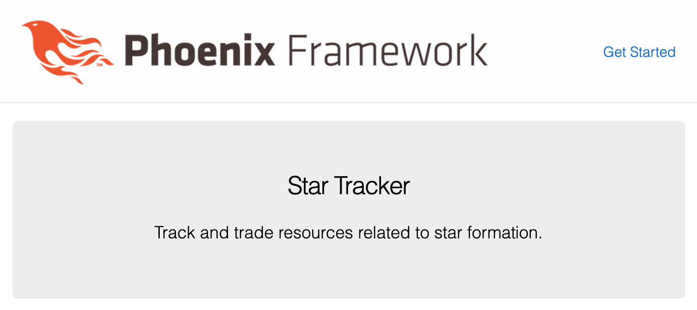
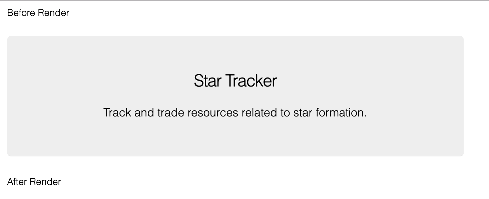
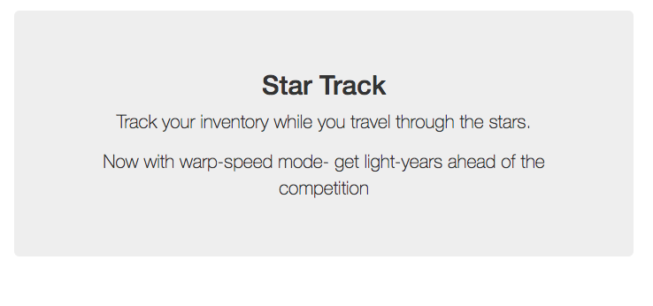

# Customizing Our Page

Now that we've got our foundational Elixir knowledge, our app is generated, and we're all set up on github and Heroku, it's time to start building our app.  We'll start with some basic customization work, getting used to some of the building blocks of a Phoenix page.

If you've worked on html pages before then much of this chapter will be review- but I'd encourage you to still at least skim the chapter in order to pick up the Phoenix-specific parts, and to put the given code in your own application in order to keep up your project in sync with ours.

---

> Technobabble: What about client-side Javascript applications?  
> The best part of
> If you do decide to use a client-side Javascript web framework, 80% of the knowledge in this book should still apply, and Phoenix is great at creating APIs.
> However, Phoenix LiveView has shrunk the range of cases where a full client-side web framework is required.  If you want your page to work offline, or to have extra-rich interactions, then you'll still want a client-side web framework, but if you just want some basic interactivity (the "sprinkles of javascript" use case) then Phoenix LiveView has you covered.

---

## The index page

We'll start with the autogenerated index page (`lib/star_tracker_web/templates/page/index.html.eex`).  This is what shows up when you visit `localhost:4000`.

<!-- web/templates/page/index.html.eex -->
```html
<section class="phx-hero">
  <h1><%= gettext "Welcome to %{name}!", name: "Phoenix" %></h1>
  <p>A productive web framework that<br/>does not compromise speed or maintainability.</p>
</section>

<section class="row">
  <article class="column">
    <h2>Resources</h2>
    <ul>
      <li>
        <a href="https://hexdocs.pm/phoenix/overview.html">Guides &amp; Docs</a>
      </li>
      <li>
        <a href="https://github.com/phoenixframework/phoenix">Source</a>
      </li>
      <li>
        <a href="https://github.com/phoenixframework/phoenix/blob/v1.4/CHANGELOG.md">v1.4 Changelog</a>
      </li>
    </ul>
  </article>
  <article class="column">
    <h2>Help</h2>
    <ul>
      <li>
        <a href="https://elixirforum.com/c/phoenix-forum">Forum</a>
      </li>
      <li>
        <a href="https://webchat.freenode.net/?channels=elixir-lang">#elixir-lang on Freenode IRC</a>
      </li>
      <li>
        <a href="https://twitter.com/elixirphoenix">Twitter @elixirphoenix</a>
      </li>
    </ul>
  </article>
</section>
```

Let's delete all that, replace it with something simpler and more manageable:

<!-- web/templates/page/index.html.eex -->
```html
<div class="phx-hero">
  <h2>Star Tracker</h2>
  <p class="lead">Track and trade resources related to star formation.</p>
</div>
```

You'll notice that the page shown at `localhost:4000` has changed automatically- this is because Phoenix uses livereload, a cool tool that saves us time and a click each time we change something in development.



Let's break down what's happening here.

First, the file ending is `.html.eex`.  The `.html` part means that it's an html web page.  The `.eex` part means that it's the templating language "Embedded Elixir".  Soon we'll be using Elixir to customize our templates on the fly, using information from cookies, the database (both explained later), and other sources to create situation-specific html pages that are served to the user.

Then we have the html itself.  Embedded Elixir is a superset of html- that is, an html page is a valid Embedded Elixir page, but then Embedded Elixir adds things on top.  The current page is just plain html.

---

> **Previously On: HTML**

> The basic building block of HTML are "elements".  In the example above we see the "div", "h2" (headline 2), and "p" (paragraph) elements.  Each of those elements has an opening tag ("<h2>"), a closing tag ("</h2>"), and some content in between ("Star Tracker").  The opening tag is the element name in between a less-than sign and a greater-than sign.  The closing tag is the same, but with a slash ("/") added right before the element name.

> There are some elements, such as "<br>" (break) that are standalone and do not have content or a closing tag.  These are sometimes written as self-closing ("<br />").  When in doubt, use a closing tag.

> Elements can have "attributes".  The attribute we see in the example above is "class".  Above we can see that the div has been given the class of "phx-hero" and the paragraph element has been given the class of "lead".  These are used by the css (we'll go over that later) to style the code and change how it looks, and sometimes by other parts of the code as well.

> We'll try to briefly touch on everything as we go, but if this information about HTML is new to you and you want to get more familiar before moving on with this book, you can learn more at [TODO: Find a good beginner html resource]()

---

So that's the Index template... but you'll notice that there's other stuff showing on the page.  Even if you delete everything in the index template there will still be content on the page.  That's because of the layout template.

## The layout template

Wrapping everything is the app layout template.  You can find it at `lib/star_tracker_web/templates/layout/app.html.eex`.

<!-- web/templates/layout/app.html.eex -->
```html
<!DOCTYPE html>
<html lang="en">
  <head>
    <meta charset="utf-8"/>
    <meta http-equiv="X-UA-Compatible" content="IE=edge"/>
    <meta name="viewport" content="width=device-width, initial-scale=1.0"/>
    <title>StarTracker · Phoenix Framework</title>
    <link rel="stylesheet" href="<%= Routes.static_path(@conn, "/css/app.css") %>"/>
  </head>
  <body>
    <header>
      <section class="container">
        <nav role="navigation">
          <ul>
            <li><a href="https://hexdocs.pm/phoenix/overview.html">Get Started</a></li>
          </ul>
        </nav>
        <a href="http://phoenixframework.org/" class="phx-logo">
          " alt="Phoenix Framework Logo"/>
        </a>
      </section>
    </header>
    <main role="main" class="container">
      <p class="alert alert-info" role="alert"><%= get_flash(@conn, :info) %></p>
      <p class="alert alert-danger" role="alert"><%= get_flash(@conn, :error) %></p>
      <%= render @view_module, @view_template, assigns %>
    </main>
    <script type="text/javascript" src="<%= Routes.static_path(@conn, "/js/app.js") %>"></script>
  </body>
</html>
```

A lot of this should look familiar if you've worked on any web apps before.

You've got your enveloping `html` tags, which contain the `head` and `body` tags.

`head` contains a title (shown in the browser tab), a link to the css stylesheet, and lots of `meta` tags.  We'll leave those all be for now- customizing them is mostly for SEO (Search Engine Optimization) purposes and is the same across web frameworks.

The `body` tag contains what's actually shown on the page.  

First, we've got a `header` tag that contains navigation links.

Then after that, we've got a `main` tag with role `main` and class `container` that contains and wraps all our other content.  Within the container div we've got a header, two alert paragraphs, and a render block (`<%= render @view_module, @view_template, assigns %>`) which will render everything else in the app.

Finally, we've got a script tag that contains any javascript we've written (we'll explain later when we get there).  

Go ahead and delete the header so our `body` tag looks like this:

<!-- web/templates/layout/app.html.eex (excerpt)-->
```html
<body>
  <main role="main" class="container">
    <p class="alert alert-info" role="alert"><%= get_flash(@conn, :info) %></p>
    <p class="alert alert-danger" role="alert"><%= get_flash(@conn, :error) %></p>
    <%= render @view_module, @view_template, assigns %>
  </main>
  <script type="text/javascript" src="<%= Routes.static_path(@conn, "/js/app.js") %>"></script>
</body>
```

Now we're left with the two flash paragraphs and the renderer.  The flash paragraphs only show up when we want to display a flash message.  The renderer is where the rest of the app is placed - it's where the index page we worked on before goes.

To demonstrate that, let's put some marker text before and after the render block.

<!-- web/templates/layout/app.html.eex (excerpt)-->
```html
<main role="main" class="container">
  <p class="alert alert-info" role="alert"><%= get_flash(@conn, :info) %></p>
  <p class="alert alert-danger" role="alert"><%= get_flash(@conn, :error) %></p>
  <p>Before Render</p>
  <%= render @view_module, @view_template, assigns %>
  <p>After Render</p>
</main>
```

<!-- TODO: check to make sure this is right -->


So that's the basic layout of the page.  The only thing left to go over is the `<%= %>` construct.

## Embedded Elixir

The `<%= %>` is the Embedded Elixir part of "Embedded Elixir templates".  Any time you see that you know that your Elixir app is feeding custom information into the template.

`<%= render @view_module, @view_template, assigns %>` is what displays the index page (or another page, depending on the URL).  Other Embedded Elixir blocks in the layout put in Javascript, CSS, and alert messages.

It's okay if you don't understand all of that right now- in the upcoming chapters, we'll be starting with simple Embedded Elixir and building up from there.

## Exercises

1. Update your app to what we have (except for the "Before Render" and "After Render" stuff... leave that out)
2. After the lead paragraph element in the index page, add a new paragraph that says "Now with warp-speed mode... get light-years ahead of the competition".



## Extra Resources

* TODO: find a good HTML course

## Conclusion

In this chapter we looked at the index page and the default app layout page (we can have alternate layouts within an application).  We reviewed HTML, customized both of the aforementioned pages, and got our first taste of Embedded Elixir.

This chapter was either 80% review or a firehose of new information, depending on your background in web apps.  As we go on through the book those difficulty levels should both adjust to the middle, but while we're in these opening parts it's best to recognize where you are and either skim or do extra research (see the Extra Resources section) based on how you're feeling about the material.

Next we're going to create our own custom page.  This will let us trace through the basic path of a Phoenix web request and introduce us to the Router and a Controller.
