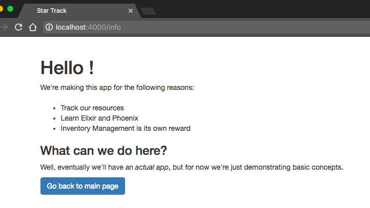
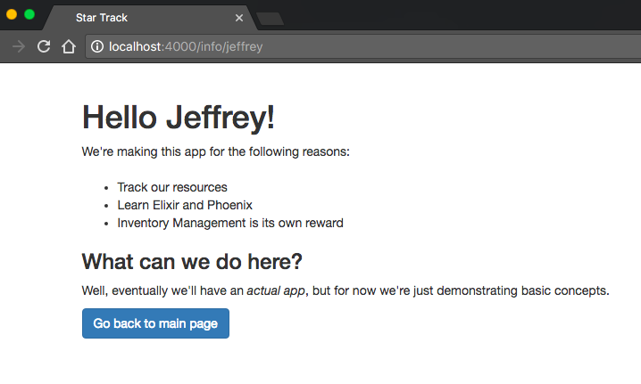
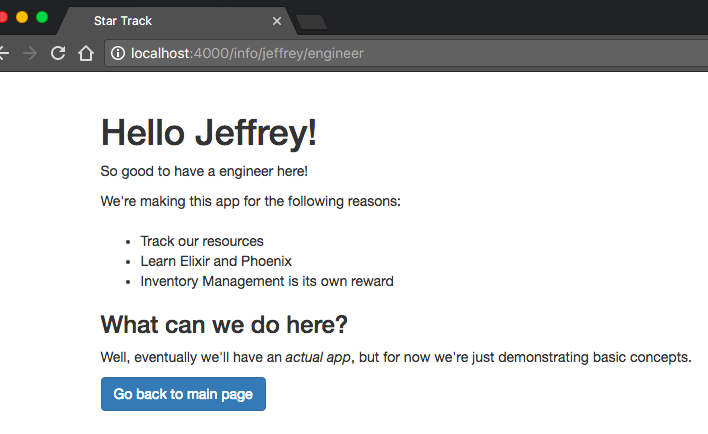

# Passing Data

Working with and responding to dynamic data is one of the core responsibilities of a Phoenix app.  Without that, it would be just a very complex way of writing static HTML!

While dynamic data will eventually come from your users, your database, and other apps, for this chapter we're going to focus on the initial task of passing data in between your Controller, Template, and Router.

## Controller to Template

We'll start with the end in mind--displaying dynamic data to your user.

<!-- web/templates/page/info.html.eex -->
```html
<h1>Hello <%= @name %>!</h1>

<p>We're making this app for the following reasons:</p>

<!-- ... -->
```

Here's the updated start of our info page.  We've added `<%= @name %>` as part of our heading.

The `<%= %>` construct is how we embed Elixir into our HTML.  Anything inside there is Elixir code.  In this case we're displaying the variable `@name`.

Of course, that variable doesn't exist yet, so we'll get the following error:


The error says "assign @name not available in eex template", so let's make it available!

We'll do so in the Controller, by adding a Map to the end of our `render` function.

<!-- web/controllers/page_controller.ex -->
```elixir
def info(conn, _params) do
  render conn, "info.html", name: "Phoenix"
end
```

We have a map with one key-value pair- :name and "Phoenix".  This will be enough to let our page display.


And that's how we pass data from Controller to Template!

## Router to Controller

The Router takes the URL and uses that to choose a Controller and a Controller action.  However, you can also make it capture more information and then pass it along to the Controller action.

Our current Router looks like this (for brevity's sake, we're only showing the relevant scope):

<!-- web/router.ex -->
```elixir
scope "/", StarTracker do
  pipe_through :browser # Use the default browser stack

  get "/", PageController, :index
  get "/info", PageController, :info
end
```

We can choose to add a parameter to the `info` route.  Let's call that parameter 'name':

<!-- web/router.ex -->
```elixir
scope "/", StarTracker do
  pipe_through :browser # Use the default browser stack

  get "/", PageController, :index
  get "/info/:name", PageController, :info
end
```

So our new route is `/info/:name`.  `:name` is an atom instead of a plain String, marking it as a parameter.  You can type anything in there and it will map to the `:name` parameter- for example, `/info/Jeffrey`.

Let's hook it up in the Controller.

```elixir
def info(conn, params) do
  render conn, "info.html", name: params["name"]
end
```

We're now using the `params` argument (and taking away the leading underscore).  The `params` is a Map of all the URL parameters- in this case, just "name".  So you call `params["name"]` to get the information from your URL, and feed it to the `name` key in the Map you feed to `render`.


We're now using the Router to pass data from the URL to the Controller, and then on down to the Template.

## Default Parameters

However, there's a problem- if we go back to our plain `/info` route (without a parameter), we'll run into an error.


That can be solved by having two routes defined in our router:

```elixir
scope "/", StarTracker do
  pipe_through :browser # Use the default browser stack

  get "/", PageController, :index
  get "/info", PageController, :info
  get "/info/:name", PageController, :info
end
```

So now we can get the `/info` route working both with and without parameters... but it doesn't look quite right.



The extra space may seem like a small thing, but it will look like a bug to a user.

There are several ways we could handle this.  The first is to use a default name in the absence of a name passed in the URL.

```elixir
def info(conn, params) do
  name = params["name"] || "Stranger"
  render conn, "info.html", name: name
end
```

Then, on the `/info` route, it will tell display "Hello Stranger", and on the `/info/Jeffrey` route it will display "Hello Jeffrey".


If we don't want to come up with a default name we can take measures to remove the space before the exclamation point.  The simplest in this case is to use an `if` in the template.

## Template Conditionals

```html
<%= if @name do %>
  <h1>Hello <%= @name %>!</h1>
<% else %>
  <h1>Hello!</h1>
<% end %>
```


I know I've ragged on `if`s, but Embedded Elixir plays by slightly different Best Practice rules than regular Elixir.  It's still best to limit the amount of if-branching (especially nested ifs), but the strictures are a bit looser.

An `if` statement in the template starts off with this line: `<%= if @name do %>`.  The conditional between the `if` and the `do` will vary, but everything else will always be part of the `if` statement.  The block of html immediately after the `if` is what is displayed if the conditional (`@name` in this case) is "true".  I say "true" in quotes because it will be "true" for anything except `nil` or`false`- the conditional `@name` could be the boolean `true`, a number, a Map, a List, or (as is the case here) a String.

There's an optional `<% else %>` statement.  If this is present, then the block of html immediately after it will be displayed when the conditional is `false` or `nil`.

Finally, it's closed out by `<% end %>`.

You may have noticed that the starter `<%= if @name do %>` has an equals sign at the start, while `<% else %>` and `<% end %>` don't.  That's because the equals sign generally signifies that something will be displayed to the user (I guess the `else` doesn't get it because the equals sign in front of `if` already takes care of it- honestly not sure).  Try removing the equals sign and you'll see that the entire header disappears.


## Conclusion

We've now seen how data is passed from the Route URL to the Controller to the Template.  In the next chapter, we'll learn about links (one of the most important building blocks in a web page) and each loops (a common way of displaying custom data arrays), and how to combine them to let the user customize the URL without ever touching the address bar.

## Exercises

1. Bring your app up to speed with the code we wrote in the chapter.
2. Make it so the name is always capitalized, no matter how it's written in the URL



Answer:

```elixir
def info(conn, params) do
  render conn, "info.html", name: String.capitalize(params["name"])
end
```

3*. Add a second parameter to the URL- `:position`.  After the header add a line welcoming them- if their position was "Engineer", it would say "So good to have an Engineer here".



We won't make you cover all 4 possible cases of names and positions being specified or not specified- multiple optional parameters are not a pattern we'll want to use in our Phoenix apps.

Answer:

```elixir
scope "/", StarTracker do
  pipe_through :browser # Use the default browser stack

  get "/", PageController, :index
  get "/info", PageController, :info
  get "/info/:name/:position", PageController, :info
end
```

```elixir
def info(conn, params) do
  render conn, "info.html", name: String.capitalize(params["name"]),
                            position: params["position"]
end
```

```html
<%= if @name do %>
  <h1>Hello <%= @name %>!</h1>
<% else %>
  <h1>Hello!</h1>
<% end %>

<p>So good to have a <%= @position %> here!</p>
```

4**. Add a shirt color based on their position.  Here's a handy chart:

* commander -> red
* operations -> yellow
* engineer -> yellow
* security -> yellow
* scientist -> blue
* doctor -> blue
* other -> grey

 > Note: This is only true for the recent fleet operations- red/yellow used to be switched.  The security personnel, operations, and engineering all wore red shirts, mostly to hide the security personnel's blood.  Once our interactions with alien planets became more one-sided, the majority of security personnel were eliminated (by not hiring them!  As opposed to how they used to be eliminated), and command took on the symbolic risk of the red uniform.

 So if they're an Engineer, then it should say "So good to have an engineer here- love your yellow shirt!"


Answer:  There are many possible answers, of course, but I like this one because it allows an easy default statement and is easy to parse.  If the data had to be stored elsewhere (a database?) then a Map would be better, with a default of "grey" if nothing found in the map.

```elixir
def info(conn, params) do
  render conn, "info.html", name: String.capitalize(params["name"]),
                            position: params["position"],
                            shirt_color: shirt_color(params["position"])
end

def shirt_color(position) do
  case position do
    "commander" -> "red"
    "engineer" -> "yellow"
    "operations" -> "yellow"
    "security" -> "yellow"
    "scientist" -> "blue"
    "doctor" -> "blue"
    _ -> "grey"
  end
end
```

```html
<%= if @name do %>
  <h1>Hello <%= @name %>!</h1>
<% else %>
  <h1>Hello!</h1>
<% end %>

<p>So good to have a <%= @position %> here- love your <%= @shirt_color %> shirt!</p>
```
