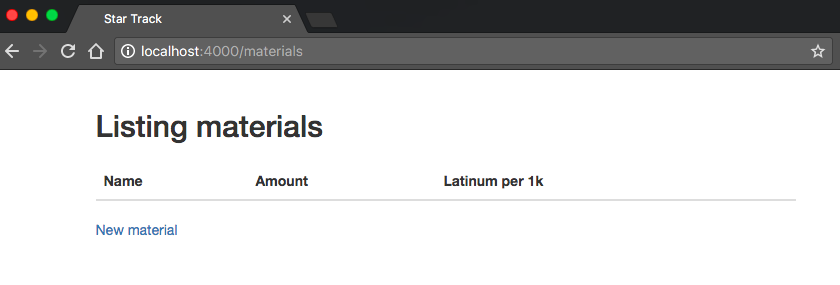
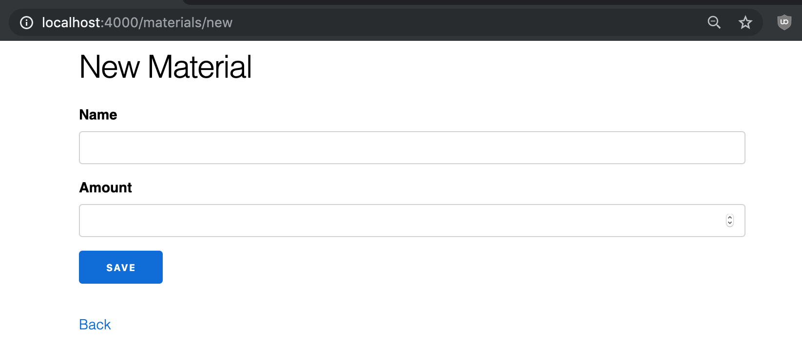
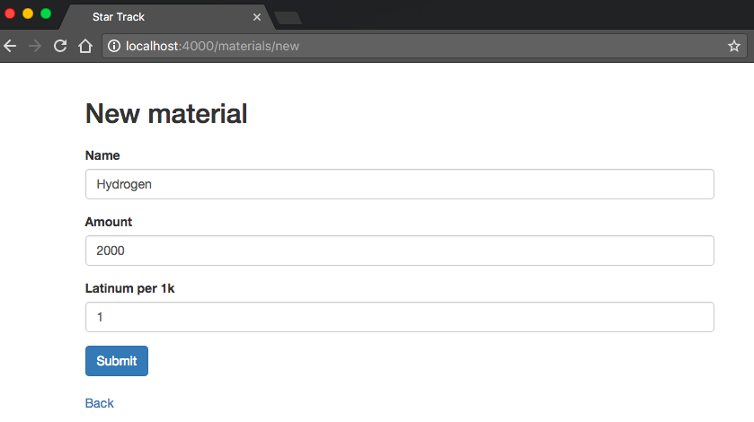
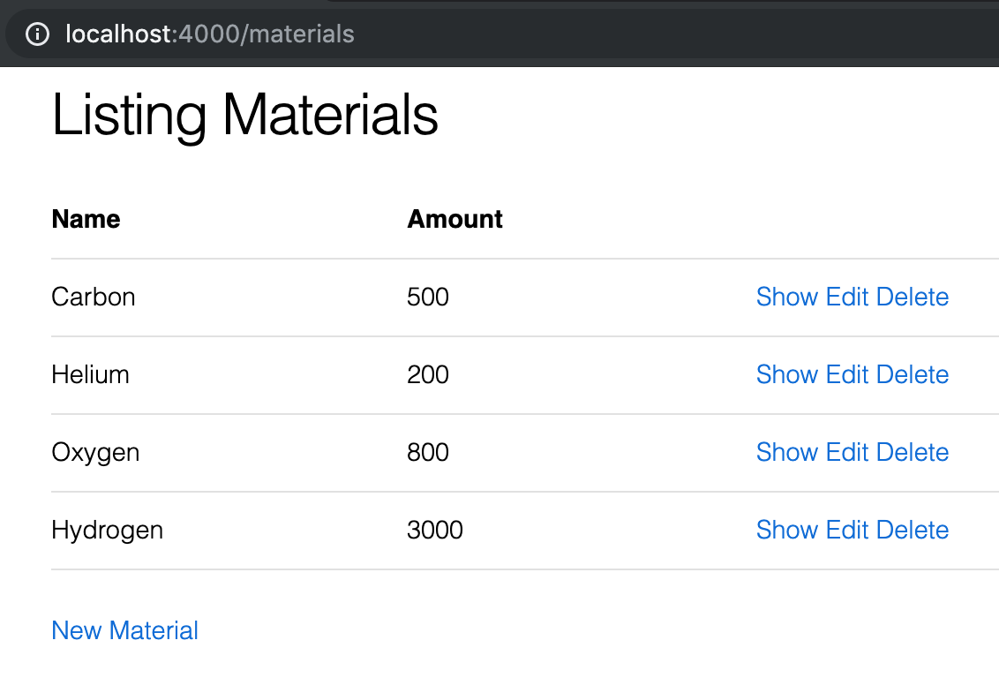

# Generating Resources

So far we've been introducing concepts piece by piece, building up a slowly more complex page.  However, the interconnected nature of Phoenix means that if we kept on doing that, we'd spend quite a bit of time with incomplete or broken features.  Instead of doing that, we're going to jump ahead and use a Phoenix generator to create a complete resource, then go over customizing it piece by piece.

For this chapter, we're going to generate the resource, input several instances of it into the database, then look at the various ways we can interact with the default generated pages (without looking at the underlying code of those pages).

## The generate task

We'll be doing the code generation by running a mix task from the command line- specifically `mix phoenix.gen.html`.  `mix` is Elixir's task runner (more on it later), and `phoenix.gen.html` is the name of the task we're running.  We're going to be adding a few more options to this task, giving us the complete command below:

```bash
mix phoenix.gen.html Material materials name:string amount:decimal latinum_per_1k:decimal
```

The first two arguments, `Material` and `materials`, are the singular and plural forms of the name of the resource we're generating.  Phoenix chose to be explicit about this rather than trying to guess the plural, like in some other popular frameworks, because being explicit in this case results in less confusion.  This is an outgrowth of Phoenix's general philosophy- abstract away what you can, but when an abstraction could cause confusion, prefer being explicit over obtaining that last inch of magical convenience.

So we have the capitalized singular and the lower-case plural.  The other three options are all fields for our resource.  The part before the colon is the name of the field, while the part after the colon is the type.  In the instance of `name:string`, the field is called `name`, while it will be stored in the database as a `string`.  `string` will also determine part of the code generated in the templates.

Run the task.

```bash
$ mix phoenix.gen.html Material materials name:string amount:decimal latinum_per_1k:decimal
* creating web/controllers/material_controller.ex
* creating web/templates/material/edit.html.eex
* creating web/templates/material/form.html.eex
* creating web/templates/material/index.html.eex
* creating web/templates/material/new.html.eex
* creating web/templates/material/show.html.eex
* creating web/views/material_view.ex
* creating test/controllers/material_controller_test.exs
* creating web/models/material.ex
* creating test/models/material_test.exs
* creating priv/repo/migrations/20170511103235_create_material.exs

Add the resource to your browser scope in web/router.ex:

    resources "/materials", MaterialController

Remember to update your repository by running migrations:

    $ mix ecto.migrate
```

Then follow the instructions given by the mix command.  First we'll add the resources line to `web/router.ex`:

```elixir
scope "/", StarTracker do
  pipe_through :browser # Use the default browser stack

  resources "/materials", MaterialController

  get "/", PageController, :index
  get "/info", PageController, :info
  #...
end
```

This adds several available urls to our application, which we'll be visiting later in this chapter.

Then we'll run the ecto migration:

```bash
$ mix ecto.migrate
Compiling 9 files (.ex)
Generated star_tracker app

05:36:14.156 [info]  == Running StarTracker.Repo.Migrations.CreateMaterial.change/0 forward

05:36:14.156 [info]  create table materials

05:36:14.205 [info]  == Migrated in 0.0s
```

This changes the database, creating the table `materials`- which is where we'll store our materials data.

## Adding materials

Run `mix phoenix.server` to get everything running again.

Then visit `localhost:4000/materials`.



We've got the "Listing Materials" header, an empty table with three columns (matching the three fields we put in the generator), and a "New material" button.

Let's click the "New material" button.



The route we're at now is `/materials/new`.  Here we've got a form with three fields- once again, corresponding to what we put in the generator.

Let's fill them out- name as "Hydrogen", amount as 2000, and latinum_per_1k (displayed here as "Latinum per 1k") as 1.



The name is self-explanatory, the amount is how much of the material we have, and latinum_per_1k is the sale price of the material.

Click the "Submit" button and you'll find yourself back at the `/materials` route.


Now the table isn't empty- it's filled with the item you just created.

Let's create more.


We've added several more materials.  Notice one in particular- gold-pressed latinum.  This isn't a typical element like the others.  We won't use it to create materials, and will instead use it as a unit of exchange.  For the purposes of our app, it's important that 1k_per_latinum is exactly 1000 for gold-pressed latinum.

Now let's check out those buttons to the right.

## Exploring the default actions

`delete` does exactly what you'd expect- it deletes a material.

`show` takes you to a page that shows you that one material


The url for the `show` page of Hydrogen is `materials/1`.  If you visit the `show` page of another material you'll get a URL with a different number.  That number is the `id` of the material in the database- a unique identifier and therefore a great way to determine which resource we're talking about (unlike the name, which can change).  

The id is automatically assigned.  In this case it's "1" because this is the first material we created and our current id-assignment scheme is sequential starting from 1.

The contents of the `show` page is the displayed data for the resource.  Currently this is exactly what's in the table on our index page, but often this includes more data than the table or a more user-friendly (but space-consuming) display of said data.

Below that we have two links we can click- `Edit` and `Back`.  `Back` will take us back to our index page, so let's click the more interesting `Edit` link.


The url here is `materials/1/edit`.  The `1` part is the id, determined the same way as in the `show` page.

You'll notice that the contents of this page are almost exactly like our `new` form, except that the data fields come pre-filled (with the current data) and it says "Edit" up top instead of "New".  We'll see why that is later when we look at how these pages are constructed.

Go ahead and change the update the `amount` to 3000 and click `Submit`.


It automatically redirects us to the `show` page, with the `amount` changed.

Click the `Back` button to take us back to the `index` page.



And we'll see our table as before, but with the updated amount of Hydrogen.

## Conclusions

That's how we generate and interact with a basic resource.  We'll be going over that piece by piece over the next several chapter, showing how each part works and how we can customize it.  We'll start by looking at what goes into the `index` route, tracing what happens starting from `web/router.ex`.

## Exercises

1. Generate the materials resource as show in the chapter.  Use the same fields.
2. Input several materials into the database.
3. Edit one of the materials.
4. Delete one of the materials.
