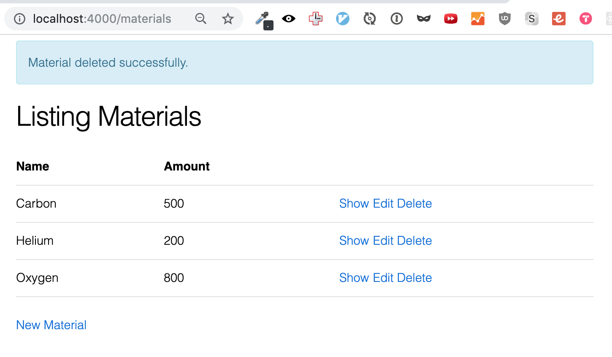
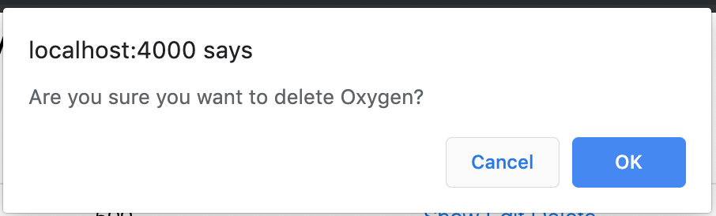

# Deleting a Materal

In the last two chapters, we covered the Index and the Show pages.  They were both primarily about _displaying_ information.

For the rest of this section, we're going to be working with routes and actions where we change information.  We may still display information while doing that, but our primary goal is to change things.

To ease our way into these concepts, we're going to start with clicking a link to delete a material from the database.

## The Link

The button itself is in the Index page, in the set of three buttons in the final `td` of each row.

```html
<%= link "Delete", to: Routes.material_path(@conn, :delete, material), method: :delete, data: [confirm: "Are you sure?"] %>
```

We already went over how the options in this particular link works in chapter 3.2, so instead of picking apart the link helper again we'll start investigating where clicking it takes us.

In our router, we've defined `resources "/materials", MaterialController`, which is defining the 7 separate routes that create a RESTful resource.  One of those is `delete "/materials/:id", MaterialController, :delete`, which is where the link above will take us.

Then that will send us to the `delete` method on the `MaterialController`.

```elixir
defmodule StarTrackerWeb.MaterialController do
  use StarTrackerWeb, :controller

  alias StarTracker.Trade
  # ...
  def delete(conn, %{"id" => id}) do
    material = Trade.get_material!(id)
    {:ok, _material} = Trade.delete_material(material)

    conn
    |> put_flash(:info, "Material deleted successfully.")
    |> redirect(to: Routes.material_path(conn, :index))
  end
end
```

Here we're doing the following steps:

0. Matching the passed-in ID param.
1. Getting the material from the database.
2. Deleting the material from the database.
3. Setting a flash message.
4. Redirecting to the Index.

Getting the `id` is basic pattern-matching of the params Map.

Then the material uses the same function on the `Trade` context as we used to get the material for the show page.

Then after that we start getting into the new stuff.

## Deleting from the Database

The next line calls the `delete_material` function on the `Trade` context.

```elixir
{:ok, _material} = Trade.delete_material(material)
```

Let's take a look at that function.

```elixir
def delete_material(%Material{} = material) do
  Repo.delete(material)
end
```

The first thing to notice is that the argument is pattern-matched so it has to be a `Material`.  If you try to feed it a string, an integer, or a random Map, then it will throw one of those "no function clause matching" errors.

Next, we call the function `Repo.delete`.  It does exactly what it says, and returns a tuple: `{:ok, material}`.

Yes, it returns the material that we just deleted.  We destroyed the database record, but that doesn't mean we can't still pass around a Map containing the material's information.  However, we won't be using it right now, as indicated by the fact that our actual pattern-matched tuple is `{:ok, _material}`, with an underscore in front of the variable name.

Aside from returning the deleted material (which we just discarded), pattern-matching the tuple also allows us to catch errors better.  If there's an error, it will throw at that line when the `:ok` atom isn't matched.

## Flash Messages

The next line is

```elixir
conn
|> put_flash(:info, "Material deleted successfully.")
```

Remember, this is the same as:

```elixir
put_flash(conn, :info, "Material deleted successfully.")
```

`put_flash` takes three arguments: the connection, the type of flash message (`:info` and `:error` available by default), and then the message itself.

It returns the `conn` we gave as the first argument, but with an `:info` flash attached.

That will then be used by the following line in `app.html.eex`:

```html
<p class="alert alert-info" role="alert"><%= get_flash(@conn, :info) %></p>
```

And will show up like this:

{ width=60% }

When you visit any other page (or reload the current page) the flash message will go away.

## Redirection

Our final line is a redirect.

```elixir
|> redirect(to: Routes.material_path(conn, :index))
```

It's taking the `conn` returned from the `put_flash` message as the first argument.  The second argument is a hash, in this case containing the `to:` option.  The `x_path` construct should be familiar from when we were using them in the `link` helper, and it works the exact same way here.

So we go to the `index` function on the `MaterialController` and run through that, getting the materials list and displaying the `index` template.

## Why Redirect?

We're already on the Material Index route, so why redirect?

Because every action in a request/response cycle must end with a render or a redirect.  If you don't, it will error.

What if you want to delete from multiple screens and have the redirect behavior be different?

Well, I can see two options.

One, which you'll want to choose most of the time, is to have your controllers be small enough that adding a second controller method isn't horrible.  This already happens by default for most routes; note that `delete`, at 5 lines of code, is our longest controller method yet.

The other option is to have the route that you're redirecting to be fed in via a parameter.  The upside is that you can use the same controller method and route over and over.  The downside is that it's breaking the default pattern of where Phoenix wants you to put information, and can therefore confuse later developers.

## Conclusion

In this chapter we walked through the `delete` function on `MaterialController`.  Along the way we learned about the `Repo.delete` function, how returning a tuple can help catch errors, how flash messages work, and how and why we redirect back to the index page.

We'll use much of that knowledge in the next chapter, where we'll walk through the `new` and `create` methods, and show how to use forms and Ecto changesets.

## Exercises

1. What happens if you try to redirect to the show page of the material you just deleted?  You're feeding in a `%Material` directly, so why does it error?
2. Add two more flash messages: a second `:info` and an `:error`.  What happens?  Why do you think that is?
3. In the confirmation message before deleting a material, include the name of the element.


{ width=60% }
