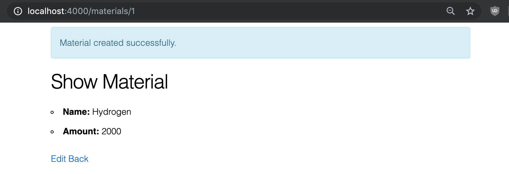

# Generating Resources

So far we've been introducing concepts piece by piece, building up a slowly more complex page.  However, the interconnected nature of Phoenix means that if we kept on doing that, we'd spend quite a bit of time with incomplete or broken features.  Instead of doing that, we're going to jump ahead and use a Phoenix generator to create a complete resource, then go over customizing it piece by piece.

For this chapter, we're going to generate the resource, input several instances of it into the database, then look at the various ways we can interact with the default generated pages (without looking at the underlying code of those pages).  In the later chapters of the section we'll look at the code that's been generated, understand how it works, and see what will happen when we change it.

## The generate task

We'll be doing the code generation by running a mix task from the command line- specifically `mix phx.gen.html`.  `mix` is Elixir's task runner (more on it later), and `phx.gen.html` is the name of the task we're running.  We're going to be adding a few more options to this task, giving us the complete command below:

```bash
mix phx.gen.html Trade Material materials name:string amount:integer
```

The first argument, `Trade`, is the _context_.  They're a useful organizational tool which we'll say more about later; in this tutorial, we'll have two contexts: `Trade` and `Auth`.

The next two arguments, `Material` and `materials`, are the singular and plural forms of the name of the resource we're generating.  Phoenix chose to be explicit about this rather than trying to guess the plural, like in some other popular frameworks, because being explicit in this case results in less confusion.  This is an outgrowth of Phoenix's general philosophy: abstract away what you can, but when an abstraction could cause confusion, prefer being explicit over obtaining that last inch of magical convenience.

So we have the capitalized singular and the lower-case plural.  The other two options are both fields for our resource.  The part before the colon is the name of the field, while the part after the colon is the type.  In the instance of `name:string`, the field is called `name`, while it will be stored in the database as a `string`.  `string` will also determine part of the code generated in the templates.

Run the task.

```bash
$ mix phx.gen.html Trade Material materials name:string amount:integer
* creating lib/star_tracker_web/controllers/material_controller.ex
* creating lib/star_tracker_web/templates/material/edit.html.eex
* creating lib/star_tracker_web/templates/material/form.html.eex
* creating lib/star_tracker_web/templates/material/index.html.eex
* creating lib/star_tracker_web/templates/material/new.html.eex
* creating lib/star_tracker_web/templates/material/show.html.eex
* creating lib/star_tracker_web/views/material_view.ex
* creating test/star_tracker_web/controllers/material_controller_test.exs
* creating lib/star_tracker/trade/material.ex
* creating priv/repo/migrations/20190506123826_create_materials.exs
* creating lib/star_tracker/trade.ex
* injecting lib/star_tracker/trade.ex
* creating test/star_tracker/trade_test.exs
* injecting test/star_tracker/trade_test.exs

Add the resource to your browser scope in lib/star_tracker_web/router.ex:

    resources "/materials", MaterialController


Remember to update your repository by running migrations:

    $ mix ecto.migrate

```

Then follow the instructions given by the mix command.  First we'll add the resources line to `web/router.ex`:

```elixir
scope "/", StarTracker do
  pipe_through :browser # Use the default browser stack

  resources "/materials", MaterialController

  get "/", PageController, :index
  get "/info", PageController, :info
  #...
end
```

This adds several available urls to our application, which we'll be visiting later in this chapter.

Then we'll run the ecto migration:

```bash
$ mix ecto.migrate
Compiling 17 files (.ex)
Generated star_tracker app

[info]  == Running 20190506124749 StarTracker.Repo.Migrations.CreateMaterials.change/0 forward
[info]  create table materials
[info]  == Migrated 20190506124749 in 0.0s
```

This changes the database, creating the table `materials`- which is where we'll store our materials data.

## Adding materials

Run `mix phx.server` to get everything running again.

```bash
$ mix phx.server
[info] Running StarTrackerWeb.Endpoint with cowboy 2.6.3 at 0.0.0.0:4000 (http)
[info] Access StarTrackerWeb.Endpoint at http://localhost:4000

Webpack is watching the files…
```

Then visit `localhost:4000/materials`.

{ width=60% }

We've got the "Listing Materials" header, an empty table with two columns (matching the two fields we put in the generator), and a "New material" button.

Let's click the "New material" button.

{ width=60% }

The route we're at now is `/materials/new`.  Here we've got a form with two fields -- once again, corresponding to what we put in the generator.

Let's fill them out with "Hydrogen" for the name and 2000 as the amount.

{ width=60% }

The name is self-explanatory, and in a move that will anger scientists the world over, we're not attaching any units to the amount.  Sorry.  Think of it as two thousand moles of Hydrogen, if that helps you cope.

> There are 6.022x10^23 atoms in a mole.  One mole of Hydrogen is 1.008 grams.  One mole of Helium is 4.003 grams, and one mole of Carbon is 12.011 grams.  You don't need to remember any of that, since we're not actually attaching units in the app, but this fancy Chemical Physics degree needs to pay its way somehow.

Click the "Submit" button and you'll find yourself at the route `/materials/1`.  It gives you a nice "Material created successfully" message, then shows the material you just created.

{ width=60% }

We have two buttons at the bottom: `edit` and `back`.

For now, let's hit the `back` button, which will take us to the materials index page at `/materials`.

{ width=60% }

Now the table isn't empty- it's filled with the item you just created.

Let's create more.

{ width=60% }

Now that we've got our table filled out, let's check out those buttons to the right.

## Exploring the default actions

`delete` does exactly what you'd expect- it deletes a material.

`show` takes you back `/materials/1`, which is sometimes colloquially called the "show page", because it shows us one item.

{ width=40% }

If you visit the `show` page of another material you'll get a URL with a different number.  That number is the `id` of the material in the database- a unique identifier and therefore a great way to determine which resource we're talking about (unlike the name, which can change).

The id is automatically assigned.  In this case it's "1" because this is the first material we created and our current id-assignment scheme is sequential starting from 1.

The contents of the `show` page is the displayed data for the resource.  Currently this is exactly what's in the table on our index page, but often this includes more data than the table or a more user-friendly (but space-consuming) display of said data.

Below that we have two links we can click: `Edit` and `Back`.  `Back` will take us back to our index page, so let's click the more interesting `Edit` link.

{ width=60% }

The url here is `materials/1/edit`.  The `1` part is the id, determined the same way as in the `show` page.

You'll notice that the contents of this page are almost exactly like our `new` form, except that the data fields come pre-filled (with the current data) and it says "Edit" up top instead of "New".  We'll see why that is later when we look at how these pages are constructed.

Go ahead and change the update the `amount` to 3000 and click `Submit`.

{ width=60% }

It automatically redirects us to the `show` page, with the `amount` changed and a nice "Material updated successfully" message.

Click the `Back` button to take us back to the `index` page.  We'll see our table as before, but with the updated amount of Hydrogen.

## Conclusions

That's how we generate and interact with a basic resource.  We'll be going over that piece by piece over the next several chapter, showing how each part works and how we can customize it.  We'll start by looking at what goes into the `index` route, tracing what happens starting from `web/router.ex`.

## Exercises

1. Generate the materials resource as shown in the chapter.  Use the same fields.
2. Input several materials into the database.
3. Edit one of the materials.
4. Delete one of the materials.
