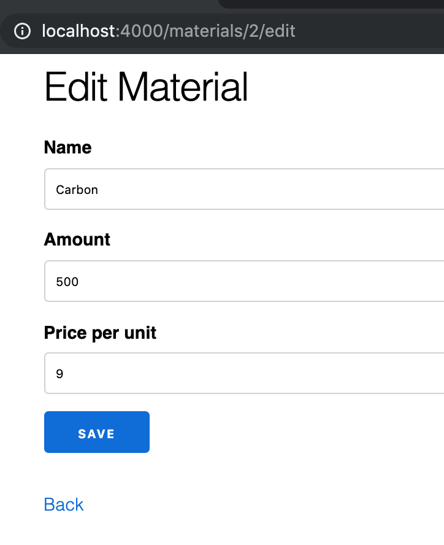

# Adding a Field

We've now completed our tour of the generated Material resource.  We've gone through the index page, the show page, the new page, the edit page, and the create, update, and delete actions.

Along the way we've learned a lot:

* routes: resources, alternate methods (post, delete, etc.), redirects
* interacting with the database via `Repo` methods
* Changesets
* Schemas
* new pattern-matching techniques
* flash messages
* templates: partials, forms, tables

Seriously, that's a lot.  Good job.

Now it's time to take a quick victory lap.

In this chapter we're going to be adding a `price` field to our Materials.  We'll be learning one new concept (migrations) and then reviewing a lot of stuff we've learned in the previous chapters in this section.

We'll need to update our app in six different places:

1. The database
2. The schema
3. The changeset
4. The form
5. The show page
6. The index page

So let's get started!

## Changing the database with migrations

First we need to add `price` to the `materials` database table.  We'll do this via a migration.

Let's take a look at the migration we've already used.  The filename will vary slightly, since part of it is determined by the time at which it was created, but it should be the only migration file in the `priv/repo/migrations` folder.

```elixir
defmodule StarTracker.Repo.Migrations.CreateMaterials do
  use Ecto.Migration

  def change do
    create table(:materials) do
      add :name, :string
      add :amount, :integer

      timestamps()
    end

  end
end
```

We have several macros (`create`, `table`, `add`, and `timestamps`) that we get from `use Ecto.Migration`.  There are others, including another that we'll be learning this section, but those are the four used in this generated migration.

All the action is happening within the `change` function.  

We create a table called `:materials`, and then we add two fields to it: `:name` and `:amount`, which have the types of `:string` and `:integer`.  The field name tells us the key to store the value under, and the type tells us what form the values will take.

We also add `timestamps()`, which adds `inserted_at` and `updated_at` fields with a type of `:naive_datetime`.

So that's what the generate migration does.  Now it's time to create the migration that will add `price` to the database.

Let's go to the command line to generate it.

```bash
$ mix ecto.gen.migration add_price_to_materials
* creating priv/repo/migrations/20190509073235_add_price_to_materials.exs
```

Now let's find the file that was just generated.  Your filename will differ from mine, but it should be in the same folder and end with `add_price_to_materials.exs`.

```elixir
defmodule StarTracker.Repo.Migrations.AddPriceToMaterials do
  use Ecto.Migration

  def change do

  end
end
```

It gives us the boilerplate, setting up a blank `change` function.  Let's fill it in.

```elixir
defmodule StarTracker.Repo.Migrations.AddPriceToMaterials do
  use Ecto.Migration

  def change do
    alter table(:materials) do
      add :price, :integer
    end
  end
end
```

Instead of creating a table with `create`, we're going to alter it with `alter`.  This is another macro that `use Ecto.Migration` gives us.  

The syntax for adding a field is the same as before, and just like `:amount`, `:price` is an integer.

Now let's go ahead and use this migration to change the database.

```bash
$ mix ecto.migrate
[info] == Running 20190509073235 StarTracker.Repo.Migrations.AddPriceToMaterials.change/0 forward
[info] alter table materials
[info] == Migrated 20190509073235 in 0.0s
```

Notice that we only ran this one migration, and not the previous one.  That's because `mix ecto.migrate` will only run the migrations that haven't already been run.

If you try it again, you'll see that no changes are made, since everything's already been run.

```bash
$ mix ecto.migrate
[info] Already up
```

So now our database table has a new field!  Let's change the rest of our Ecto setup to match.

## Changing the Schema and Changeset

We define both the Schema and the Changeset for our materials in the `StarTracker.Trade.Material` module.  Let's update those to include the `price`.

```elixir
defmodule StarTracker.Trade.Material do
  use Ecto.Schema
  import Ecto.Changeset

  schema "materials" do
    field :amount, :integer
    field :name, :string
    field :price, :integer

    timestamps()
  end

  @doc false
  def changeset(material, attrs) do
    material
    |> cast(attrs, [:name, :amount, :price])
    |> validate_required([:name, :amount, :price])
  end
end
```

We've added the line `field :price, :integer` to the schema, which will now allow that in all `%Material{}` Schemas.

We've also added `:price` to both the `cast` and `validate_required` portions of the `changeset` pipeline.  This means that when the user fills out the price on the form it will get turned into data in the database, and that if they don't fill anything out for the price then there will be an error.

And, of course, that error will happen automatically if we don't add the price field to the form, so let's go do that.

## Adding the price field to the form

We're going to copy the code for `:amount` and just change the atom used to `:price`.  We'll also customize the label a bit by using the optional third argument, but that's about it.

```html
<%= form_for @changeset, @action, fn f -> %>
  <%= if @changeset.action do %>
    <div class="alert alert-danger">
      <p>Oops, something went wrong! Please check the errors below.</p>
    </div>
  <% end %>

  <%= label f, :name %>
  <%= text_input f, :name %>
  <%= error_tag f, :name %>

  <%= label f, :amount %>
  <%= number_input f, :amount %>
  <%= error_tag f, :amount %>

  <%= label f, :price, "Price Per Unit" %>
  <%= number_input f, :price %>
  <%= error_tag f, :price %>

  <div>
    <%= submit "Save" %>
  </div>
<% end %>
```

Now we've got it displaying the price.

{ width=40% }

## Price on the show page

To add the price to the show page, we'll extend the pattern we've used for the other attributes.

```html
<h1>Show Material</h1>

<ul>
  <li>
    <strong>Name:</strong>
    <%= @material.name %>
  </li>
  <li>
    <strong>Amount:</strong>
    <%= @material.amount %>
  </li>
  <li>
    <strong>Price:</strong>
    <%= @material.price %>
  </li>
</ul>

<span><%= link "Edit", to: Routes.material_path(@conn, :edit, @material) %></span>
<span><%= link "Back", to: Routes.material_path(@conn, :index) %></span>
```

There's no new concepts here, we're just repeating the pattern with our new field.

{ width=40% }

## Price on the Index page

To add the price to the Index page, we'll add to our loop a table data cell (`td`) containing the price of our material.  We'll also add a table header cell (`th`) that contains the name of the column.

```html
<h1>Listing Materials</h1>

<table>
  <thead>
    <tr>
      <th>Name</th>
      <th>Amount</th>
      <th>Price</th>

      <th></th>
    </tr>
  </thead>
  <tbody>
    <%= for material <- @materials do %>
      <tr>
        <td><%= material.name %></td>
        <td><%= material.amount %></td>
        <td><%= material.price %></td>

        <td>
          <%= link "Show", to: Routes.material_path(@conn, :show, material) %>
          <%= link "Edit", to: Routes.material_path(@conn, :edit, material) %>
          <%= link "Delete", to: Routes.material_path(@conn, :delete, material), method: :delete, data: [confirm: "Are you sure you want to delete #{material.name}?"] %>
        </td>
      </tr>
    <% end %>
  </tbody>
</table>

<span><%= link "New Material", to: Routes.material_path(@conn, :new) %></span>
```

Once again, there are no new concepts in this code.  This is the logical extension of the way we've displayed data in the table before.

{ width=60% }

## Conclusion

In this chapter we added the `:price` field to our materials.

We learned how to create and run a custom migration to add it to the database, then how to edit our Schema and Changeset so our code can interact with the database correctly.  Although we'd touched on these before, this is the first time we made serious changes.

Finally we updated our templates: the edit form, the show page, and the index page.  These simply extended the patterns we'd set forth in previous versions of the templates.  However, there are sometimes reasons to make more extensive edits to the templates.  In future chapters we'll see how complex data can make it necessary to change.  In the next chapter, which is optional, we'll show how to change how our app looks through extensive changes in the template's display code.

## Exercises

1. Add a `description` field to our app.  
  a. Create and run the migration that adds it.
  b. Add it to the schema and changeset; changing it should be allowed but not required
  c. Add the field to the form.  Hint: look up the `textarea` input field.
  d. Display the field in the show page.
  e. Display a checkmark (html code: `&#10004` &#10004;) in the index page if a description is present;
2.
